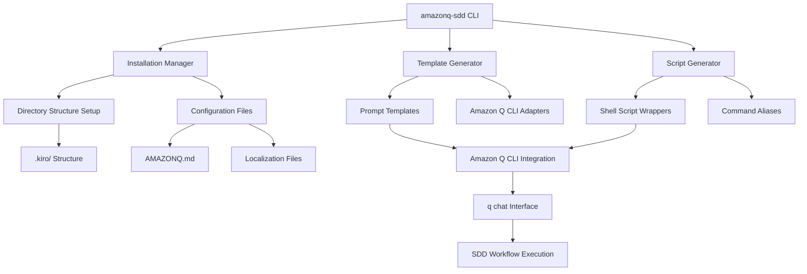
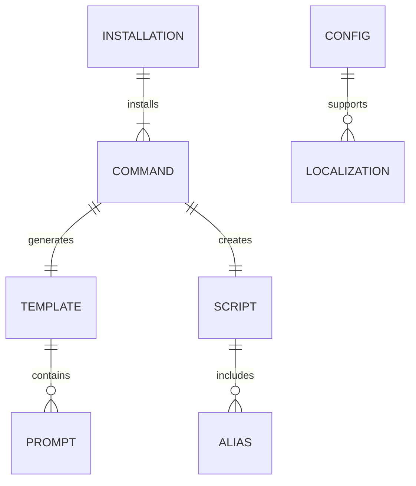

# Technical Design

## Overview
This design implements a standalone `amazonq-sdd` NPM package that provides spec-driven development capabilities for Amazon Q CLI users. Since Amazon Q CLI doesn't support slash commands like Claude Code, the solution uses a hybrid approach combining shell script wrappers, structured prompt templates, and configuration management to deliver equivalent SDD functionality.

The architecture bridges the gap between Amazon Q CLI's chat-based interface and the systematic SDD workflow, enabling users to execute commands like `kiro-spec-init` that integrate seamlessly with Amazon Q CLI's natural language processing capabilities.

## Requirements Mapping

### Design Component Traceability
Each design component addresses specific requirements:
- **NPM Package Architecture** → 2.1, 2.3, 2.5: Standalone package with installation and functionality
- **Shell Script Wrapper System** → 1.1, 1.3, 1.4: 8 SDD commands adapted for Amazon Q CLI format
- **Prompt Template Engine** → 1.2, 1.5, 4.1: Amazon Q CLI-compatible command formatting
- **Configuration Management** → 5.1, 5.2, 5.3: AMAZONQ.md and localization support
- **Directory Structure Manager** → 3.1, 4.3: Logical organization and .kiro/ structure
- **Validation System** → 6.1, 6.2, 6.3: Template validation and error handling
- **Installation CLI** → 7.1, 7.3, 7.4: Seamless user experience

### User Story Coverage
- **Amazon Q CLI Command Template System**: Shell wrappers + prompt templates provide equivalent functionality
- **NPM Package Creation**: Standalone package with CLI installation tool
- **Template Organization**: Clear directory structure with platform-specific variations
- **Feature Parity**: Same .kiro/ structure and 3-phase approval workflow
- **Documentation**: AMAZONQ.md with Amazon Q CLI-specific instructions
- **Testing**: Comprehensive validation system for template generation
- **User Experience**: Simple installation with clear feedback and error handling

## Architecture



### Technology Stack
Based on research findings and requirements analysis:

- **Package Manager**: NPM for distribution and installation
- **CLI Framework**: Node.js with Commander.js for CLI interface
- **Template Engine**: Handlebars.js for dynamic template generation
- **Shell Integration**: Cross-platform shell script generation (bash/zsh/powershell)
- **Configuration**: JSON/YAML for package configuration, Markdown for documentation
- **Testing**: Jest for unit testing + shell script validation
- **Distribution**: NPM registry with semantic versioning

### Architecture Decision Rationale

- **Why Shell Script Wrappers**: Amazon Q CLI lacks plugin system, so wrapper scripts provide command-line integration while maintaining familiar command names
- **Why Prompt Templates**: Amazon Q CLI excels at natural language processing, so structured prompts leverage its strengths while maintaining SDD workflow integrity
- **Why Node.js CLI**: NPM distribution model matches cc-sdd, provides cross-platform compatibility, and enables rapid development
- **Why Handlebars Templates**: Mature templating system with logic support, enables dynamic content generation based on user preferences and platform detection
- **Why Cross-platform Shell Scripts**: Ensures compatibility across macOS, Windows, and Linux environments

## Components and Interfaces

### Backend Services & Method Signatures

```typescript
class InstallationManager {
  install(options: InstallOptions): Promise<InstallResult>       // Main installation entry point
  detectAmazonQCLI(): Promise<boolean>                          // Check if Amazon Q CLI is installed
  createDirectoryStructure(path: string): Promise<void>         // Create .kiro/ directories
  generateConfigFiles(config: Config): Promise<void>           // Create AMAZONQ.md and localization
}

class TemplateGenerator {
  generatePromptTemplates(commands: Command[]): Promise<Template[]>  // Create Q CLI-compatible prompts
  adaptForAmazonQCLI(template: Template): Template                   // Convert from cc-sdd format
  validateTemplate(template: Template): ValidationResult             // Ensure Amazon Q CLI compatibility
}

class ScriptGenerator {
  generateWrapperScripts(commands: Command[]): Promise<Script[]>   // Create shell script wrappers
  createCommandAliases(platform: Platform): Promise<Alias[]>      // Generate platform-specific aliases
  validateScripts(scripts: Script[]): Promise<ValidationResult[]> // Test script execution
}

class ConfigurationManager {
  generateAmazonQConfig(options: ConfigOptions): Promise<Config>   // Create AMAZONQ.md
  handleLocalization(lang: Language): Promise<LocalizedConfig>     // Generate localized documentation
  validateConfiguration(config: Config): ValidationResult         // Ensure config correctness
}
```

### Frontend Components
Since this is a CLI tool, components refer to command-line interfaces:

| Component | Responsibility | Options/Arguments |
|-----------|---------------|-------------------|
| `amazonq-sdd` | Main CLI entry point | `--lang`, `--os`, `--dry-run`, `--help` |
| `kiro-spec-init` | Wrapper for spec initialization | `<description>` |
| `kiro-spec-requirements` | Requirements generation wrapper | `<feature-name>` |
| `kiro-spec-design` | Design generation wrapper | `<feature-name>`, `-y` |
| `kiro-spec-tasks` | Task generation wrapper | `<feature-name>`, `-y` |
| `kiro-spec-impl` | Implementation wrapper | `<feature-name>`, `<task-ids>` |
| `kiro-spec-status` | Status checking wrapper | `<feature-name>` |
| `kiro-steering` | Steering management wrapper | None |
| `kiro-steering-custom` | Custom steering wrapper | `<filename>` |

### API Endpoints
The package provides a programmatic API for integration:

| Method | Interface | Purpose | Parameters | Return Type |
|--------|-----------|---------|------------|-------------|
| install | CLI | Install amazonq-sdd templates | InstallOptions | Promise<InstallResult> |
| generate | CLI | Generate specific command templates | GenerateOptions | Promise<Template[]> |
| validate | CLI | Validate Amazon Q CLI compatibility | ValidateOptions | Promise<ValidationResult> |
| configure | CLI | Update configuration files | ConfigOptions | Promise<Config> |

## Data Models

### Domain Entities
1. **Command**: Represents a single SDD command (spec-init, spec-requirements, etc.)
2. **Template**: Amazon Q CLI-compatible prompt template for a command
3. **Script**: Shell script wrapper that integrates with Amazon Q CLI
4. **Config**: Configuration data for AMAZONQ.md and related files
5. **InstallOptions**: User preferences for installation (language, platform, etc.)

### Entity Relationships


### Data Model Definitions

```typescript
interface Command {
  name: string;                    // e.g., 'spec-init'
  description: string;             // Command description
  arguments: CommandArgument[];    // Expected arguments
  template: string;               // Prompt template path
  scriptTemplate: string;        // Shell script template path
  platforms: Platform[];         // Supported platforms
}

interface Template {
  id: string;
  commandName: string;
  promptText: string;             // Structured prompt for Amazon Q CLI
  variables: TemplateVariable[];  // Dynamic content placeholders
  metadata: TemplateMetadata;     // Amazon Q CLI-specific metadata
}

interface Script {
  commandName: string;
  platform: Platform;
  scriptContent: string;         // Generated shell script content
  executable: boolean;           // Whether script should be made executable
  aliasName: string;             // Command alias (e.g., 'kiro-spec-init')
}

interface Config {
  projectName: string;
  language: Language;
  amazonQCLIPath: string;        // Path to Amazon Q CLI binary
  kiroDirectory: string;         // .kiro/ directory location
  localization: LocalizedStrings;
}

interface InstallOptions {
  language?: Language;           // 'en' | 'ja' | 'zh-TW'
  platform?: Platform;          // 'mac' | 'windows' | 'linux'
  kiroDirectory?: string;        // Custom .kiro/ location
  dryRun?: boolean;             // Preview changes without applying
}
```

### Shell Script Integration Model

```bash
#!/bin/bash
# Generated shell script template for kiro-spec-init

AMAZONQ_CLI="${AMAZONQ_CLI_PATH:-q}"
KIRO_DIR="${KIRO_DIR:-.kiro}"

# Structured prompt for Amazon Q CLI
PROMPT="I want to initialize a new specification for: $*

Please help me:
1. Generate a unique feature name from the description
2. Create the .kiro/specs/{feature-name}/ directory structure
3. Initialize requirements.md, design.md, tasks.md, and spec.json files
4. Follow the spec-driven development workflow format

Use the project context from AMAZONQ.md if available."

# Execute with Amazon Q CLI
$AMAZONQ_CLI chat "$PROMPT"
```

## Error Handling

### Error Categories and Handling Strategy
1. **Installation Errors**
   - Amazon Q CLI not found: Provide installation instructions
   - Permission errors: Guide user through permission setup
   - Directory creation failures: Offer alternative locations

2. **Template Generation Errors**  
   - Invalid template syntax: Validation with specific error messages
   - Amazon Q CLI compatibility issues: Automatic adaptation with warnings
   - Missing dependencies: Clear dependency installation instructions

3. **Runtime Errors**
   - Command execution failures: Fallback to manual prompt guidance
   - Configuration file corruption: Automatic backup and restoration
   - Network connectivity issues: Offline mode with cached templates

4. **Validation Errors**
   - Malformed configuration: Step-by-step configuration repair
   - Incompatible Amazon Q CLI version: Version compatibility matrix
   - Missing project structure: Automatic structure recreation

## Security Considerations

Security implementation following OWASP practices:

- **Input Validation**: All user inputs sanitized before shell script generation
- **File System Access**: Restricted to project directory and standard locations
- **Script Execution**: Generated scripts include safety checks and validation
- **Configuration Security**: AMAZONQ.md files exclude sensitive data patterns
- **Dependency Management**: NPM audit integration and secure dependency updates
- **Shell Injection Prevention**: All dynamic content properly escaped in script generation

## Performance & Scalability

### Performance Targets
| Metric | Target | Measurement |
|--------|--------|-------------|
| Installation Time | < 10 seconds | Full template generation |
| Template Generation | < 2 seconds | Single command template |
| Script Execution | < 5 seconds | Shell wrapper to Amazon Q CLI |
| Configuration Validation | < 1 second | Config file checking |
| Large Project Setup | < 30 seconds | Complete .kiro/ structure |

### Optimization Strategies
- **Template Caching**: Pre-compiled templates for faster generation
- **Parallel Processing**: Concurrent template and script generation
- **Lazy Loading**: Load templates only when needed
- **File System Optimization**: Minimal file operations during installation
- **Memory Management**: Streaming for large template processing

### Scalability Approach
- **Horizontal Scaling**: Package supports multiple concurrent installations
- **Template Modularity**: Individual command templates can be updated independently  
- **Configuration Flexibility**: Supports various project sizes and structures
- **Platform Adaptation**: Automatic detection and optimization for different environments

## Testing Strategy

### Risk Matrix
| Area | Risk | Must | Optional | Ref |
|---|---|---|---|---|
| Shell Script Generation | H | Unit, Integration | Cross-platform | 1.1, 6.1 |
| Amazon Q CLI Integration | H | Contract, E2E | Compatibility | 1.2, 6.2 |
| Template Validation | M | Unit, Property | Fuzzing | 6.1, 6.3 |
| Configuration Management | M | Unit, Integration | Localization | 5.1, 5.2 |
| Installation Process | H | E2E, System | Recovery | 7.1, 7.2 |

### Test Implementation Strategy

#### Unit Tests
- Template generation logic with various input combinations
- Configuration parsing and validation
- Shell script content generation and syntax validation
- Error handling for all failure scenarios
- Cross-platform path handling and script generation

#### Integration Tests
- Amazon Q CLI binary detection and version compatibility
- Complete installation flow with file system verification
- Generated shell scripts execution with Amazon Q CLI
- Configuration file generation and reading
- Localization file generation for all supported languages

#### End-to-End Tests
- Full `npx amazonq-sdd@latest` installation workflow
- Generated wrapper scripts functionality with real Amazon Q CLI
- Complete SDD workflow: spec-init → requirements → design → tasks
- Cross-platform installation on macOS, Windows, Linux

#### Contract Tests
- Amazon Q CLI command format compatibility
- Generated prompt structure validation
- Shell script syntax validation across platforms
- Configuration file schema adherence

### CI Gates
| Stage | Run | Gate | SLA |
|---|---|---|---|
| PR | Unit + Integration | Fail = block | ≤5m |
| Release | E2E + Contract | Fail = block | ≤15m |
| Nightly | Cross-platform + Compatibility | Regression → issue | - |

### Exit Criteria
- All unit and integration tests passing
- Cross-platform installation verified
- Amazon Q CLI integration working end-to-end
- Template generation producing valid Amazon Q CLI prompts
- Documentation complete for all supported languages