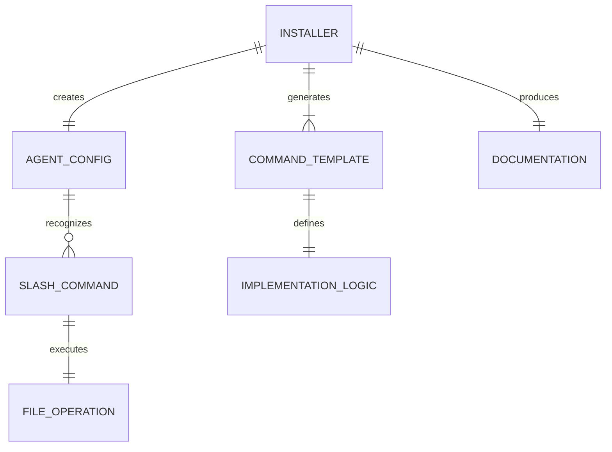

# Technical Design

## Overview
This design implements a standalone `amazonq-sdd` NPM package that provides spec-driven development capabilities for Amazon Q CLI users through Custom Agents. The solution uses Amazon Q CLI's 2025 Custom Agent system to deliver native `/kiro:` command support within `q chat --agent sdd` sessions.

The architecture combines a single-file NPX installer with embedded Custom Agent configuration and local templates, enabling users to execute commands like `/kiro:spec-init` directly within Amazon Q CLI chat sessions with full workflow state management and template customization capabilities.

## Requirements Mapping

### Design Component Traceability
Each design component addresses specific requirements:
- **NPX Installer Architecture** → 2.1, 2.3, 2.5: Single-file installer with embedded configurations
- **Custom Agent Configuration** → 1.1, 1.3, 1.4: Native `/kiro:` command recognition in Amazon Q CLI
- **Local Template System** → 1.2, 1.5, 4.1: Customizable command behavior templates
- **Documentation Generation** → 5.1, 5.2, 5.3: AMAZONQ.md and usage guides
- **Directory Structure Manager** → 3.1, 4.3: .kiro/ and .amazonq/ organization
- **Agent Prompt Engineering** → 6.1, 6.2, 6.3: Command recognition and execution logic
- **Zero Dependencies Implementation** → 7.1, 7.3, 7.4: Node.js built-in modules only

### User Story Coverage
- **Amazon Q CLI Native Integration**: Custom Agent provides native `/kiro:` command support
- **NPM Package Creation**: Single NPX installer with embedded configurations and templates
- **Template Organization**: Local `.amazonq/commands/kiro/` templates for customization
- **Feature Parity**: Same .kiro/ structure and 3-phase approval workflow as Claude Code
- **Documentation**: AMAZONQ.md with Amazon Q CLI Custom Agent instructions
- **Agent Behavior**: Detailed command implementation logic in local templates
- **User Experience**: One-command installation with immediate functionality

## Architecture

```mermaid
graph TB
    A[npx amazonq-sdd] --> B[install.js]
    
    B --> C[Custom Agent Installation]
    B --> D[Local Template Creation]
    B --> E[Documentation Generation]
    
    C --> F[~/.aws/amazonq/cli-agents/sdd.json]
    D --> G[.amazonq/commands/kiro/*.md]
    E --> H[AMAZONQ.md]
    
    F --> I[q chat --agent sdd]
    G --> I
    
    I --> J[/kiro:spec-init recognition]
    I --> K[Template-guided execution]
    I --> L[.kiro/ file operations]
    
    J --> M[SDD Workflow]
    K --> M
    L --> M
```

### Technology Stack
Based on final implementation and requirements analysis:

- **Package Manager**: NPM for distribution and NPX for installation
- **Runtime**: Node.js built-in modules only (fs, path, os, child_process)
- **Agent System**: Amazon Q CLI Custom Agents (JSON configuration)
- **Template Format**: Markdown templates with agent implementation instructions
- **Configuration**: Embedded JSON configuration and template strings
- **File Operations**: Direct fs operations with fs_read/fs_write tools
- **Distribution**: NPM registry with single-file installer approach

### Architecture Decision Rationale

- **Why Custom Agents**: Amazon Q CLI's 2025 Custom Agent system provides native slash command support within chat sessions
- **Why Local Templates**: Users can customize agent behavior by editing local templates, providing flexibility while maintaining structure
- **Why Single-File Installer**: Zero external dependencies approach with all configurations embedded in install.js
- **Why Embedded Configurations**: Eliminates supply chain risks and ensures consistent installation across environments
- **Why Node.js Built-ins Only**: Maximum compatibility and security with no external package dependencies

## Components and Interfaces

### Backend Services & Method Signatures

```javascript
// Single install.js file with embedded configurations

const SDD_AGENT_CONFIG = {
  $schema: "https://raw.githubusercontent.com/aws/amazon-q-developer-cli/refs/heads/main/schemas/agent-v1.json",
  name: "sdd",
  description: "Spec-Driven Development agent with /kiro: command support",
  tools: ["fs_read", "fs_write"],
  toolsSettings: {
    fs_write: {
      allowedPaths: [".kiro/**", "*.md", ".amazonq/**"]
    }
  },
  prompt: "Embedded agent prompt with /kiro: command recognition..."
};

const TEMPLATES = {
  'spec-init.md': 'Template content for /kiro:spec-init command...',
  'spec-requirements.md': 'Template content for /kiro:spec-requirements...',
  // ... all 8 command templates
};

function install() {
  // Create Custom Agent configuration
  // Create local templates
  // Generate AMAZONQ.md documentation
}
```

### Command Components
Native Amazon Q CLI slash commands provided by the Custom Agent:

| Command | Responsibility | Usage Pattern |
|---------|---------------|---------------|
| `/kiro:spec-init` | Initialize new specification | `/kiro:spec-init "feature description"` |
| `/kiro:spec-requirements` | Generate requirements document | `/kiro:spec-requirements feature-name` |
| `/kiro:spec-design` | Create design document | `/kiro:spec-design feature-name` |
| `/kiro:spec-tasks` | Generate task breakdown | `/kiro:spec-tasks feature-name` |
| `/kiro:spec-impl` | Implementation guidance | `/kiro:spec-impl feature-name [tasks]` |
| `/kiro:spec-status` | Check workflow status | `/kiro:spec-status feature-name` |
| `/kiro:steering` | Project steering setup | `/kiro:steering` |
| `/kiro:steering-custom` | Custom steering documents | `/kiro:steering-custom name` |

### NPX Commands
The package provides simple CLI commands for management:

| Command | Purpose | Usage | Return |
|---------|---------|-------|-------|
| install | Install SDD agent and templates | `npx amazonq-sdd install` | Installation status |
| status | Check installation status | `npx amazonq-sdd status` | Current state |
| uninstall | Remove agent and templates | `npx amazonq-sdd uninstall` | Cleanup status |
| help | Show usage information | `npx amazonq-sdd help` | Command reference |

## Data Models

### Domain Entities
1. **AgentConfig**: Amazon Q CLI Custom Agent JSON configuration
2. **CommandTemplate**: Local template defining command behavior and implementation logic
3. **InstallResult**: Status and results of installation process
4. **Documentation**: Generated AMAZONQ.md and usage guides
5. **FileOperations**: fs_read/fs_write operations for .kiro/ structure management

### Entity Relationships


### Data Model Definitions

```javascript
// Embedded data structures in install.js

const SDD_AGENT_CONFIG = {
  $schema: "https://raw.githubusercontent.com/aws/amazon-q-developer-cli/refs/heads/main/schemas/agent-v1.json",
  name: "sdd",
  description: "Spec-Driven Development agent with /kiro: command support",
  tools: ["fs_read", "fs_write"],
  toolsSettings: {
    fs_write: {
      allowedPaths: [".kiro/**", "*.md", ".amazonq/**"]
    }
  },
  prompt: "System-level prompt with embedded command recognition logic..."
};

const TEMPLATES = {
  'spec-init.md': `---
description: Initialize new SDD specification
allowed-tools: fs_read, fs_write
model: amazon-q-developer
agent: sdd
---

# Implementation logic for /kiro:spec-init command...`,
  // ... additional templates
};

const AMAZONQ_MD_TEMPLATE = `# Amazon Q CLI SDD Agent

This project uses the SDD (Spec-Driven Development) Custom Agent...`;

class InstallResult {
  constructor(success, message, files) {
    this.success = success;
    this.message = message;
    this.installedFiles = files;
  }
}
```

### Custom Agent Command Recognition Model

```markdown
# Amazon Q CLI Custom Agent: Spec Initialization

The SDD Custom Agent should recognize and execute this pattern:
```
/kiro:spec-init <description>
```

## Implementation Logic

When a user types `/kiro:spec-init "feature description"` in `q chat --agent sdd`:

### 1. Parse Command
- Extract feature description from user input
- Generate kebab-case feature name from description
- Validate description is not empty

### 2. Create Directory Structure
- Create `.kiro/specs/{feature-name}/` directory
- Ensure proper permissions and error handling

### 3. Initialize Files
- Create `requirements.md` with template structure
- Create `design.md`, `tasks.md` as empty templates
- Create `spec.json` with initial phase tracking

### 4. Provide Response
- Confirm successful initialization
- Show next steps for the user
- Reference project steering if available
```

## Error Handling

### Error Categories and Handling Strategy
1. **Installation Errors**
   - Amazon Q CLI not found: Provide installation instructions and links
   - Permission errors: Guide user through directory permission setup
   - Agent directory missing: Create ~/.aws/amazonq/cli-agents/ automatically

2. **Custom Agent Errors**  
   - Agent not loading: Provide agent status checking and reinstall instructions
   - Command not recognized: Show exact /kiro: command syntax with examples
   - File permission errors: Guide user on proper .kiro/ directory setup

3. **Template Errors**
   - Template file corruption: Recreate templates from embedded sources
   - Missing template files: Reinstall local templates automatically
   - Template customization issues: Provide template restoration options

4. **Workflow Errors**
   - Invalid spec.json: Show validation errors and auto-fix options
   - Missing workflow phases: Guide user through proper SDD sequence
   - File operation failures: Provide clear fs_write permission guidance

## Security Considerations

Security implementation following OWASP practices:

- **File System Restrictions**: Custom Agent fs_write limited to .kiro/**, *.md, .amazonq/** paths only
- **No Shell Execution**: Agent uses only fs_read/fs_write tools, no shell command execution
- **Input Validation**: All user inputs validated before file operations
- **Configuration Security**: Agent configuration contains no secrets or sensitive data
- **Zero Dependencies**: No external package dependencies eliminates supply chain risks
- **Amazon Q CLI Security**: Leverages Amazon Q CLI's built-in security model and access controls

## Performance & Scalability

### Performance Targets
| Metric | Target | Measurement |
|--------|--------|-------------|
| Installation Time | < 10 seconds | Full agent and template setup |
| Command Recognition | < 1 second | /kiro: command parsing |
| File Operations | < 3 seconds | .kiro/ structure creation |
| Agent Loading | < 2 seconds | Custom Agent initialization |
| Template Processing | < 5 seconds | Complete workflow file generation |

### Optimization Strategies
- **Embedded Configuration**: All templates and configs embedded in single installer
- **Direct File Operations**: Native fs operations without shell overhead
- **Agent Prompt Optimization**: Efficient command recognition patterns
- **Local Template Caching**: Templates stored locally for instant access
- **Minimal Network Dependency**: Only NPX download, everything else is local

### Scalability Approach
- **Horizontal Scaling**: Package supports multiple concurrent installations
- **Template Modularity**: Individual command templates can be updated independently  
- **Configuration Flexibility**: Supports various project sizes and structures
- **Platform Adaptation**: Automatic detection and optimization for different environments

## Testing Strategy

### Risk Matrix
| Area | Risk | Must | Optional | Ref |
|---|---|---|---|---|
| Custom Agent Installation | H | Unit, Integration | Recovery | 1.1, 6.1 |
| Command Recognition | H | Contract, E2E | Compatibility | 1.2, 6.2 |
| Template Generation | M | Unit, Property | Validation | 6.1, 6.3 |
| File Operations | M | Unit, Integration | Permissions | 5.1, 5.2 |
| NPX Installation | H | E2E, System | Cross-platform | 7.1, 7.2 |

### Test Implementation Strategy

#### Unit Tests
- Agent configuration generation and JSON schema validation
- Template content creation and markdown format validation
- File operation logic with various path scenarios
- Error handling for all failure scenarios
- Cross-platform directory creation and permissions

#### Integration Tests
- Custom Agent installation and Amazon Q CLI recognition
- Complete NPX installation flow with file system verification
- Local template creation and customization capabilities
- AMAZONQ.md generation and content validation
- Agent command recognition within q chat sessions

#### End-to-End Tests
- Full `npx amazonq-sdd@latest` installation workflow
- Custom Agent functionality with real Amazon Q CLI sessions
- Complete SDD workflow: /kiro:spec-init → /kiro:spec-requirements → design → tasks
- Template customization and agent behavior modification

#### Contract Tests
- Amazon Q CLI Custom Agent schema compliance
- /kiro: command recognition pattern validation
- fs_read/fs_write tool usage within allowed paths
- Template format and agent instruction compatibility

### CI Gates
| Stage | Run | Gate | SLA |
|---|---|---|---|
| PR | Unit + Integration | Fail = block | ≤5m |
| Release | E2E + Contract | Fail = block | ≤15m |
| Nightly | Cross-platform + Compatibility | Regression → issue | - |

### Exit Criteria
- All unit and integration tests passing
- Cross-platform NPX installation verified
- Custom Agent command recognition working in Amazon Q CLI
- Local template system functional and customizable
- Complete SDD workflow validated end-to-end
- Documentation and usage guides complete