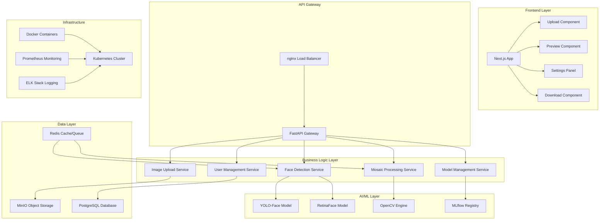
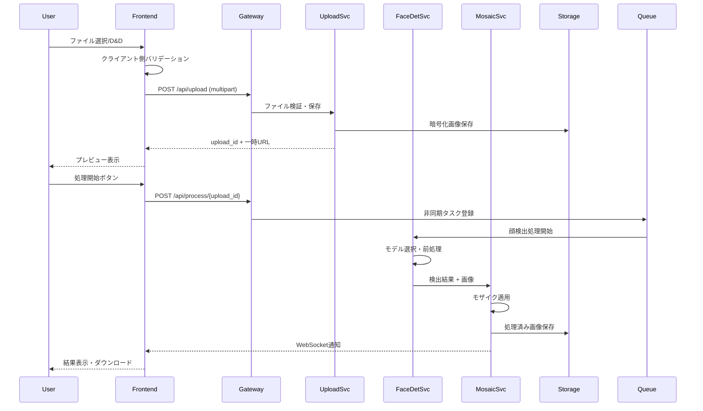
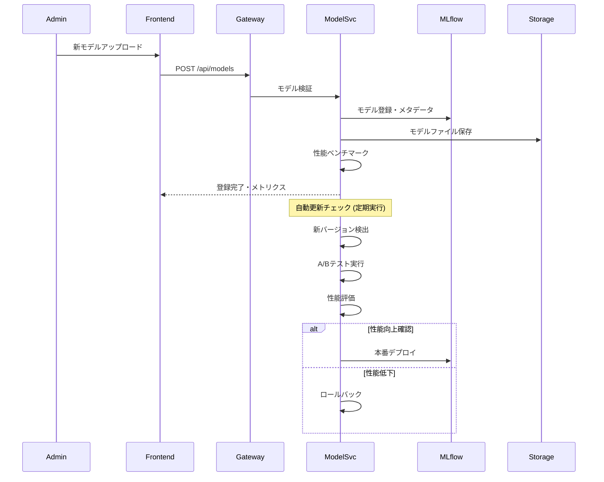
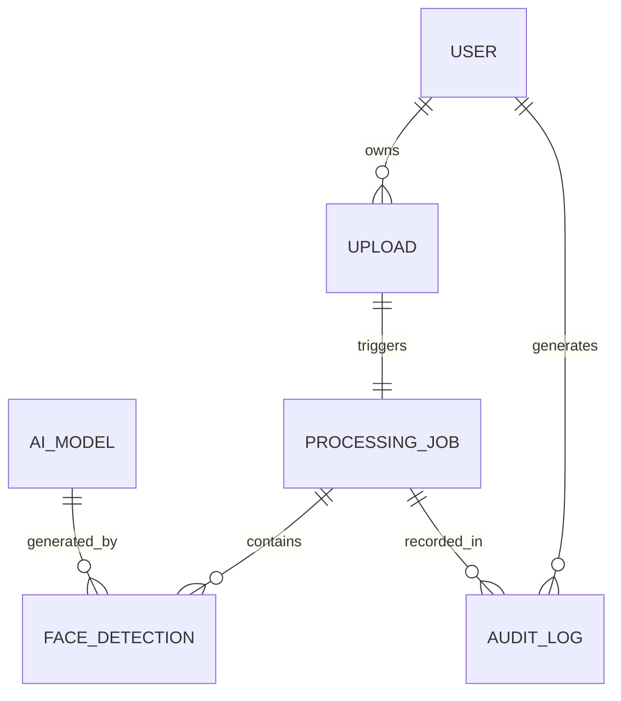
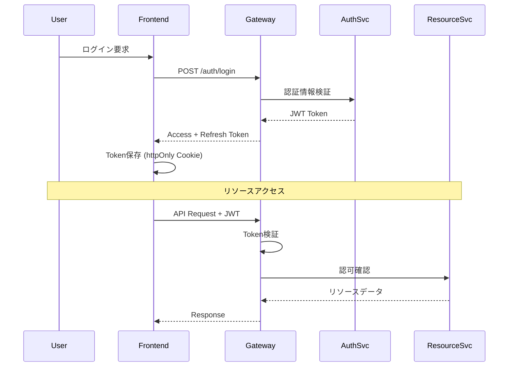
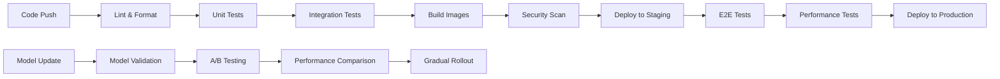

# Technical Design

## Overview
顔検出・モザイク処理アプリケーションの技術設計書。TypeScriptフロントエンド（React + Next.js）とPython FastAPIバックエンドによるマイクロサービス・アーキテクチャで構成し、柔軟なAIモデル統合とリアルタイム画像処理を実現する。プライバシー保護とスケーラビリティを重視した設計により、大量の同時処理と最新AI技術への対応を可能にする。

## Requirements Mapping

### Design Component Traceability
各設計コンポーネントが特定の要件に対応：

- **ImageUploadComponent** → 要件1: ドラッグ&ドロップ、プログレスバー、エラーハンドリング
- **FaceDetectionService** → 要件2: AIモデル自動選択、信頼度評価、前処理
- **MosaicProcessingEngine** → 要件3: リアルタイムプレビュー、カスタマイズ可能処理
- **ModelManagementService** → 要件4: 動的モデル追加、性能最適化、自動更新
- **ResponsiveUI** → 要件5: 3クリック以内操作、5秒以内ロード、モバイル対応
- **EncryptionService** → 要件6: TLS暗号化、24時間自動削除、GDPR準拠
- **LoadBalancer + QueueSystem** → 要件7: 30秒以内処理、10並列対応、自動スケーリング
- **RESTful API + WebhookService** → 要件8: バッチ処理、非同期通知、レート制限

### User Story Coverage
- **画像アップロード**: React Dropzone + FastAPI multipart → 直感的ファイル投入
- **高精度顔検出**: YOLO-Face + RetinaFace → 様々な条件での顔認識
- **カスタマイズ可能モザイク**: Canvas API + OpenCV → リアルタイム調整
- **モデル管理**: MLflow + ONNX → 柔軟なAI対応
- **直感的UI**: Next.js + Tailwind → 使いやすいインターフェース
- **プライバシー保護**: AES暗号化 + 自動削除 → 安全な画像処理
- **高速処理**: GPU加速 + Redis Queue → スケーラブル性能
- **API統合**: OpenAPI + Webhook → 外部システム連携

## Architecture



### Technology Stack
調査結果に基づく最適な技術選択：

- **Frontend**: React 18 + Next.js 14 + TypeScript 5.0
  - **UI Framework**: Tailwind CSS + Headless UI
  - **State Management**: Zustand + React Query
  - **Image Processing**: HTML5 Canvas + react-image-crop
  - **File Upload**: react-dropzone + axios
  
- **Backend**: Python 3.11 + FastAPI 0.104
  - **Async Framework**: FastAPI + uvicorn
  - **Image Processing**: OpenCV 4.8 + Pillow 10.0
  - **AI/ML**: PyTorch 2.0 + ONNX Runtime 1.16
  - **Task Queue**: Celery 5.3 + Redis 7.0
  
- **Database & Storage**: 
  - **Relational DB**: PostgreSQL 15 (ユーザー・処理履歴)
  - **Object Storage**: MinIO / AWS S3 (画像ファイル)
  - **Cache**: Redis 7.0 (セッション・キュー)
  
- **AI/ML Models**:
  - **顔検出**: YOLO-Face v8 + RetinaFace + MediaPipe
  - **モデル管理**: MLflow 2.7 + ONNX 1.14
  - **GPU加速**: CUDA 11.8 + cuDNN 8.9
  
- **Infrastructure**:
  - **Containerization**: Docker + Docker Compose
  - **Orchestration**: Kubernetes 1.28
  - **Load Balancer**: nginx 1.24
  - **Monitoring**: Prometheus + Grafana + Jaeger

### Architecture Decision Rationale
調査に基づく技術選択の根拠：

- **Why React + Next.js**: TypeScript完全サポート、SSR/SSG、自動最適化、豊富なエコシステム
- **Why FastAPI**: 非同期処理、自動API文書、型安全性、Python AI/MLエコシステムとの親和性
- **Why PostgreSQL**: ACID準拠、JSON対応、拡張性、MLflowとの相性
- **Why MinIO**: S3互換、オンプレミス対応、暗号化サポート、コスト効率
- **Why Redis**: 高速キャッシュ、Pub/Sub、Celeryとの統合、セッション管理
- **Why ONNX**: モデル互換性、最適化、クロスプラットフォーム、フレームワーク非依存

## Data Flow

### Primary User Flows

#### 1. 画像アップロード〜モザイク処理フロー



#### 2. AIモデル管理フロー



## Components and Interfaces

### Backend Services & Method Signatures

```python
class ImageUploadService:
    def validate_image(self, file: UploadFile) -> ValidationResult:
        """画像ファイルの形式・サイズ検証"""
    
    def upload_image(self, file: UploadFile, user_id: str) -> UploadResult:
        """暗号化画像アップロード・一時保存"""
    
    def get_upload_status(self, upload_id: str) -> UploadStatus:
        """アップロード状況取得"""

class FaceDetectionService:
    def select_optimal_model(self, image_metadata: ImageMetadata) -> ModelInfo:
        """画像特性に基づく最適モデル選択"""
    
    def detect_faces(self, image_id: str, model_id: str) -> List[FaceDetection]:
        """顔検出実行・信頼度評価"""
    
    def preprocess_image(self, image: np.ndarray) -> np.ndarray:
        """前処理（輝度・コントラスト調整）"""

class MosaicProcessingService:
    def apply_mosaic(self, image_id: str, faces: List[FaceDetection], settings: MosaicSettings) -> ProcessedImage:
        """モザイク処理適用"""
    
    def generate_preview(self, image_id: str, settings: MosaicSettings) -> PreviewImage:
        """リアルタイムプレビュー生成"""
    
    def batch_process(self, job_id: str, image_ids: List[str]) -> BatchResult:
        """バッチ処理実行"""

class ModelManagementService:
    def register_model(self, model_file: UploadFile, metadata: ModelMetadata) -> ModelInfo:
        """新モデル登録・検証"""
    
    def benchmark_model(self, model_id: str) -> PerformanceMetrics:
        """モデル性能ベンチマーク"""
    
    def auto_update_check(self) -> List[UpdateInfo]:
        """自動更新チェック"""
    
    def deploy_model(self, model_id: str, deployment_config: DeploymentConfig) -> DeploymentResult:
        """モデルデプロイ・ロードバランシング"""

class SecurityService:
    def encrypt_file(self, file_path: str, key: str) -> str:
        """AES-256ファイル暗号化"""
    
    def schedule_deletion(self, file_id: str, ttl_hours: int) -> None:
        """自動削除スケジュール"""
    
    def audit_access(self, user_id: str, resource_id: str, action: str) -> None:
        """アクセス監査ログ記録"""
```

### Frontend Components

| Component | Responsibility | Props/State Summary |
|-----------|---------------|-------------------|
| ImageUploadZone | ファイルD&D、選択、プレビュー | files[], uploadProgress, errors[] |
| FaceDetectionViewer | 検出結果表示、信頼度可視化 | detectedFaces[], confidenceThreshold |
| MosaicSettingsPanel | モザイク設定UI、リアルタイム調整 | mosaicType, intensity, previewMode |
| ProcessingProgressBar | 処理進捗、キャンセル制御 | progress%, stage, cancellable |
| ResultsGallery | 処理前後比較、ダウンロード | originalImage, processedImage, downloadUrl |
| ModelManagementDashboard | モデル一覧、性能メトリクス | models[], metrics[], activeModel |
| SettingsPanel | ユーザー設定、プライバシー設定 | userPrefs, privacySettings |
| TutorialOverlay | 初回ユーザーガイド | isFirstTime, currentStep, completed |

### API Endpoints

| Method | Route | Purpose | Auth | Status Codes |
|--------|-------|---------|------|--------------|
| POST | /api/upload | 画像アップロード | Optional | 201, 400, 413, 415, 500 |
| GET | /api/upload/{id}/status | アップロード状況 | Optional | 200, 404, 500 |
| POST | /api/process | 顔検出・モザイク処理開始 | Optional | 202, 400, 404, 500 |
| GET | /api/process/{id}/status | 処理進捗取得 | Optional | 200, 404, 500 |
| POST | /api/process/{id}/cancel | 処理キャンセル | Optional | 200, 404, 409, 500 |
| GET | /api/download/{id} | 処理済み画像取得 | Required | 200, 404, 410, 500 |
| POST | /api/models | AIモデル登録 | Admin | 201, 400, 403, 500 |
| GET | /api/models | モデル一覧・メトリクス | Admin | 200, 403, 500 |
| POST | /api/models/{id}/benchmark | 性能テスト実行 | Admin | 202, 404, 403, 500 |
| PUT | /api/models/{id}/deploy | モデルデプロイ | Admin | 200, 404, 403, 500 |
| POST | /api/batch | バッチ処理要求 | Required | 202, 400, 401, 500 |
| POST | /api/webhook/register | Webhook登録 | Required | 201, 400, 401, 500 |

## Data Models

### Domain Entities
1. **Upload**: アップロード情報・メタデータ
2. **ProcessingJob**: 処理ジョブ・進捗状況
3. **FaceDetection**: 検出された顔情報
4. **AIModel**: 登録済みAIモデル
5. **User**: ユーザー情報・設定
6. **AuditLog**: セキュリティ監査ログ

### Entity Relationships



### Data Model Definitions

```typescript
interface Upload {
  id: string;
  userId?: string;
  filename: string;
  contentType: string;
  fileSize: number;
  status: 'uploading' | 'completed' | 'failed';
  encryptedPath: string;
  previewUrl?: string;
  expiresAt: Date;
  createdAt: Date;
}

interface ProcessingJob {
  id: string;
  uploadId: string;
  status: 'queued' | 'processing' | 'completed' | 'failed' | 'cancelled';
  progress: number;
  currentStage: string;
  modelId: string;
  settings: MosaicSettings;
  resultUrl?: string;
  errorMessage?: string;
  startedAt?: Date;
  completedAt?: Date;
  createdAt: Date;
}

interface FaceDetection {
  id: string;
  jobId: string;
  boundingBox: BoundingBox;
  confidence: number;
  landmarks?: FaceLandmarks;
  mosaicApplied: boolean;
  mosaicSettings?: MosaicSettings;
}

interface AIModel {
  id: string;
  name: string;
  version: string;
  framework: 'pytorch' | 'onnx' | 'tensorflow';
  modelType: 'face_detection' | 'face_recognition';
  filePath: string;
  metadata: ModelMetadata;
  performance: PerformanceMetrics;
  isActive: boolean;
  createdAt: Date;
}
```

```python
@dataclass
class Upload:
    id: str
    user_id: Optional[str]
    filename: str
    content_type: str
    file_size: int
    status: Literal['uploading', 'completed', 'failed']
    encrypted_path: str
    preview_url: Optional[str]
    expires_at: datetime
    created_at: datetime

@dataclass
class ProcessingJob:
    id: str
    upload_id: str
    status: Literal['queued', 'processing', 'completed', 'failed', 'cancelled']
    progress: int
    current_stage: str
    model_id: str
    settings: MosaicSettings
    result_url: Optional[str]
    error_message: Optional[str]
    started_at: Optional[datetime]
    completed_at: Optional[datetime]
    created_at: datetime

@dataclass
class FaceDetection:
    id: str
    job_id: str
    bounding_box: BoundingBox
    confidence: float
    landmarks: Optional[FaceLandmarks]
    mosaic_applied: bool
    mosaic_settings: Optional[MosaicSettings]

@dataclass
class AIModel:
    id: str
    name: str
    version: str
    framework: Literal['pytorch', 'onnx', 'tensorflow']
    model_type: Literal['face_detection', 'face_recognition']
    file_path: str
    metadata: ModelMetadata
    performance: PerformanceMetrics
    is_active: bool
    created_at: datetime
```

### Database Schema

```sql
-- PostgreSQL Schema
CREATE TABLE uploads (
    id UUID PRIMARY KEY DEFAULT gen_random_uuid(),
    user_id UUID,
    filename VARCHAR(255) NOT NULL,
    content_type VARCHAR(100) NOT NULL,
    file_size BIGINT NOT NULL,
    status VARCHAR(20) NOT NULL CHECK (status IN ('uploading', 'completed', 'failed')),
    encrypted_path TEXT NOT NULL,
    preview_url TEXT,
    expires_at TIMESTAMP WITH TIME ZONE NOT NULL,
    created_at TIMESTAMP WITH TIME ZONE DEFAULT NOW()
);

CREATE TABLE processing_jobs (
    id UUID PRIMARY KEY DEFAULT gen_random_uuid(),
    upload_id UUID NOT NULL REFERENCES uploads(id) ON DELETE CASCADE,
    status VARCHAR(20) NOT NULL CHECK (status IN ('queued', 'processing', 'completed', 'failed', 'cancelled')),
    progress INTEGER DEFAULT 0 CHECK (progress >= 0 AND progress <= 100),
    current_stage VARCHAR(100),
    model_id UUID NOT NULL REFERENCES ai_models(id),
    settings JSONB NOT NULL,
    result_url TEXT,
    error_message TEXT,
    started_at TIMESTAMP WITH TIME ZONE,
    completed_at TIMESTAMP WITH TIME ZONE,
    created_at TIMESTAMP WITH TIME ZONE DEFAULT NOW()
);

CREATE TABLE face_detections (
    id UUID PRIMARY KEY DEFAULT gen_random_uuid(),
    job_id UUID NOT NULL REFERENCES processing_jobs(id) ON DELETE CASCADE,
    bounding_box JSONB NOT NULL,
    confidence DECIMAL(5,4) NOT NULL CHECK (confidence >= 0 AND confidence <= 1),
    landmarks JSONB,
    mosaic_applied BOOLEAN DEFAULT FALSE,
    mosaic_settings JSONB
);

CREATE TABLE ai_models (
    id UUID PRIMARY KEY DEFAULT gen_random_uuid(),
    name VARCHAR(255) NOT NULL,
    version VARCHAR(50) NOT NULL,
    framework VARCHAR(20) NOT NULL CHECK (framework IN ('pytorch', 'onnx', 'tensorflow')),
    model_type VARCHAR(30) NOT NULL CHECK (model_type IN ('face_detection', 'face_recognition')),
    file_path TEXT NOT NULL,
    metadata JSONB NOT NULL,
    performance JSONB NOT NULL,
    is_active BOOLEAN DEFAULT TRUE,
    created_at TIMESTAMP WITH TIME ZONE DEFAULT NOW(),
    UNIQUE(name, version)
);

-- インデックス
CREATE INDEX idx_uploads_user_id ON uploads(user_id);
CREATE INDEX idx_uploads_expires_at ON uploads(expires_at);
CREATE INDEX idx_processing_jobs_status ON processing_jobs(status);
CREATE INDEX idx_face_detections_job_id ON face_detections(job_id);
CREATE INDEX idx_ai_models_active ON ai_models(is_active) WHERE is_active = TRUE;
```

### Migration Strategy
- **段階的移行**: 既存データの段階的変換
- **後方互換性**: 古いAPIバージョンサポート（6ヶ月）
- **ダウンタイム最小化**: ブルーグリーンデプロイメント
- **データ変換**: ETLパイプラインによる安全な移行

## Error Handling

### エラー分類とハンドリング戦略

```python
class FaceMosaicError(Exception):
    """ベースエラークラス"""
    pass

class ValidationError(FaceMosaicError):
    """入力値検証エラー"""
    pass

class ProcessingError(FaceMosaicError):
    """画像処理エラー"""
    pass

class ModelError(FaceMosaicError):
    """AIモデル関連エラー"""
    pass

class SecurityError(FaceMosaicError):
    """セキュリティ関連エラー"""
    pass

# エラーハンドラー
@app.exception_handler(ValidationError)
async def validation_error_handler(request: Request, exc: ValidationError):
    return JSONResponse(
        status_code=400,
        content={
            "error": "validation_error",
            "message": str(exc),
            "details": exc.details if hasattr(exc, 'details') else None
        }
    )

@app.exception_handler(ProcessingError)
async def processing_error_handler(request: Request, exc: ProcessingError):
    logger.error(f"Processing error: {exc}", exc_info=True)
    return JSONResponse(
        status_code=500,
        content={
            "error": "processing_error",
            "message": "画像処理中にエラーが発生しました",
            "retry_possible": True
        }
    )
```

### フロントエンドエラーハンドリング

```typescript
class ErrorBoundary extends Component<Props, State> {
  constructor(props: Props) {
    super(props);
    this.state = { hasError: false, error: null };
  }

  static getDerivedStateFromError(error: Error): State {
    return { hasError: true, error };
  }

  componentDidCatch(error: Error, errorInfo: ErrorInfo) {
    // エラー監視サービスに送信
    ErrorMonitoring.captureException(error, { errorInfo });
  }

  render() {
    if (this.state.hasError) {
      return <ErrorFallback error={this.state.error} />;
    }
    return this.props.children;
  }
}

// API エラーハンドリング
const apiClient = axios.create({
  timeout: 30000,
  retry: 3,
  retryDelay: (retryCount) => retryCount * 1000
});

apiClient.interceptors.response.use(
  (response) => response,
  (error) => {
    if (error.response?.status === 413) {
      toast.error('ファイルサイズが大きすぎます（50MB以下にしてください）');
    } else if (error.response?.status === 415) {
      toast.error('対応していないファイル形式です（JPEG、PNG、WebPのみ）');
    } else {
      toast.error('処理中にエラーが発生しました。しばらく後に再試行してください。');
    }
    return Promise.reject(error);
  }
);
```

## Security Considerations

### Authentication & Authorization



### Authorization Matrix

| Role | Upload | Process | Download | Model Mgmt | Admin |
|------|--------|---------|----------|------------|-------|
| Anonymous | ✓ | ✓ | ✓ | ✗ | ✗ |
| User | ✓ | ✓ | ✓ (own) | ✗ | ✗ |
| Admin | ✓ | ✓ | ✓ | ✓ | ✓ |

### Data Protection

```python
class EncryptionService:
    def __init__(self):
        self.cipher_suite = Fernet(self._get_encryption_key())
    
    def encrypt_file(self, file_path: str) -> str:
        """AES-256によるファイル暗号化"""
        with open(file_path, 'rb') as file:
            file_data = file.read()
        encrypted_data = self.cipher_suite.encrypt(file_data)
        
        encrypted_path = f"{file_path}.encrypted"
        with open(encrypted_path, 'wb') as encrypted_file:
            encrypted_file.write(encrypted_data)
        
        # 元ファイル削除
        os.remove(file_path)
        return encrypted_path
    
    def decrypt_file(self, encrypted_path: str) -> str:
        """復号化とストリーミング配信"""
        with open(encrypted_path, 'rb') as encrypted_file:
            encrypted_data = encrypted_file.read()
        decrypted_data = self.cipher_suite.decrypt(encrypted_data)
        
        # メモリ上で処理（一時ファイル作成なし）
        return io.BytesIO(decrypted_data)

# 自動削除スケジューラー
@celery.task
def cleanup_expired_files():
    expired_uploads = db.query(Upload).filter(
        Upload.expires_at < datetime.utcnow(),
        Upload.status == 'completed'
    ).all()
    
    for upload in expired_uploads:
        try:
            # 暗号化ファイル削除
            if os.path.exists(upload.encrypted_path):
                secure_delete(upload.encrypted_path)
            
            # 処理済みファイル削除
            job = db.query(ProcessingJob).filter_by(upload_id=upload.id).first()
            if job and job.result_url:
                secure_delete(job.result_url)
            
            # DB記録削除
            db.delete(upload)
            
        except Exception as e:
            logger.error(f"Failed to cleanup {upload.id}: {e}")
    
    db.commit()

def secure_delete(file_path: str):
    """セキュアファイル削除（3回上書き）"""
    if os.path.exists(file_path):
        filesize = os.path.getsize(file_path)
        with open(file_path, "r+b") as file:
            for _ in range(3):
                file.seek(0)
                file.write(os.urandom(filesize))
                file.flush()
                os.fsync(file.fileno())
        os.remove(file_path)
```

### Security Best Practices

```python
# OWASP Top 10 対策
from fastapi import FastAPI, Depends, HTTPException
from fastapi.middleware.cors import CORSMiddleware
from fastapi.middleware.trustedhost import TrustedHostMiddleware
from fastapi_limiter import FastAPILimiter
from fastapi_limiter.depends import RateLimiter

app = FastAPI()

# セキュリティヘッダー
@app.middleware("http")
async def add_security_headers(request: Request, call_next):
    response = await call_next(request)
    response.headers["X-Content-Type-Options"] = "nosniff"
    response.headers["X-Frame-Options"] = "DENY"
    response.headers["X-XSS-Protection"] = "1; mode=block"
    response.headers["Strict-Transport-Security"] = "max-age=31536000; includeSubDomains"
    response.headers["Content-Security-Policy"] = "default-src 'self'"
    return response

# CORS設定
app.add_middleware(
    CORSMiddleware,
    allow_origins=["https://yourdomain.com"],
    allow_credentials=True,
    allow_methods=["GET", "POST", "PUT", "DELETE"],
    allow_headers=["*"],
)

# 信頼できるホストのみ許可
app.add_middleware(
    TrustedHostMiddleware,
    allowed_hosts=["yourdomain.com", "*.yourdomain.com"]
)

# レート制限
@app.post("/api/upload")
async def upload_image(
    file: UploadFile,
    _: int = Depends(RateLimiter(times=10, seconds=60))  # 1分間に10回まで
):
    # アップロード処理
    pass

# 入力値検証
from pydantic import BaseModel, validator

class ProcessingRequest(BaseModel):
    upload_id: str
    mosaic_intensity: int
    mosaic_type: str
    
    @validator('mosaic_intensity')
    def validate_intensity(cls, v):
        if not 1 <= v <= 100:
            raise ValueError('Mosaic intensity must be between 1 and 100')
        return v
    
    @validator('mosaic_type')
    def validate_type(cls, v):
        allowed_types = ['pixelate', 'blur', 'blackout']
        if v not in allowed_types:
            raise ValueError(f'Mosaic type must be one of {allowed_types}')
        return v
```

## Performance & Scalability

### Performance Targets

| Metric | Target | Measurement |
|--------|--------|-------------|
| 画像アップロード (p95) | < 5秒 | 10MB画像 |
| 顔検出処理 (p95) | < 15秒 | 5MB画像、5人 |
| モザイク処理 (p95) | < 10秒 | 検出後適用 |
| API応答時間 (p99) | < 500ms | 非処理エンドポイント |
| 同時処理数 | 10+並列 | GPU1基あたり |
| スループット | 100画像/分 | ピーク時処理能力 |
| Memory使用量 | < 4GB | 1プロセスあたり |
| ディスク使用率 | < 80% | 一時保存領域 |

### Caching Strategy

```python
# 多層キャッシング戦略
import redis
from functools import wraps

redis_client = redis.Redis(host='redis', port=6379, db=0)

def cache_result(expiration=3600):
    def decorator(func):
        @wraps(func)
        async def wrapper(*args, **kwargs):
            # キャッシュキー生成
            cache_key = f"{func.__name__}:{hash(str(args) + str(kwargs))}"
            
            # キャッシュ確認
            cached_result = redis_client.get(cache_key)
            if cached_result:
                return json.loads(cached_result)
            
            # 処理実行
            result = await func(*args, **kwargs)
            
            # キャッシュ保存
            redis_client.setex(
                cache_key, 
                expiration, 
                json.dumps(result, default=str)
            )
            
            return result
        return wrapper
    return decorator

# モデル予測結果キャッシング
@cache_result(expiration=7200)  # 2時間
async def detect_faces(image_hash: str, model_id: str):
    # 同じ画像・同じモデルの場合、結果を再利用
    pass

# プリコンパイル済みモデルキャッシング
class ModelCache:
    def __init__(self):
        self._models = {}
        self._model_lock = asyncio.Lock()
    
    async def get_model(self, model_id: str):
        if model_id not in self._models:
            async with self._model_lock:
                if model_id not in self._models:
                    model = await self.load_model(model_id)
                    self._models[model_id] = model
        return self._models[model_id]
```

### Scalability Approach

```yaml
# Kubernetes Horizontal Pod Autoscaler
apiVersion: autoscaling/v2
kind: HorizontalPodAutoscaler
metadata:
  name: face-mosaic-api-hpa
spec:
  scaleTargetRef:
    apiVersion: apps/v1
    kind: Deployment
    name: face-mosaic-api
  minReplicas: 3
  maxReplicas: 20
  metrics:
  - type: Resource
    resource:
      name: cpu
      target:
        type: Utilization
        averageUtilization: 70
  - type: Resource
    resource:
      name: memory
      target:
        type: Utilization
        averageUtilization: 80
  - type: Pods
    pods:
      metric:
        name: processing_queue_length
      target:
        type: AverageValue
        averageValue: "5"

---
# GPU Nodepool for AI Processing
apiVersion: v1
kind: Node
metadata:
  labels:
    node-type: gpu-worker
    nvidia.com/gpu: "true"
spec:
  taints:
  - key: nvidia.com/gpu
    value: "true"
    effect: NoSchedule
```

```python
# 適応的リソース管理
class ResourceManager:
    def __init__(self):
        self.current_load = 0
        self.max_capacity = 10
        self.gpu_available = torch.cuda.is_available()
    
    async def acquire_processing_slot(self) -> bool:
        if self.current_load >= self.max_capacity:
            return False
        
        self.current_load += 1
        return True
    
    def release_processing_slot(self):
        self.current_load = max(0, self.current_load - 1)
    
    def get_optimal_batch_size(self) -> int:
        """GPU メモリと現在の負荷に基づく最適バッチサイズ"""
        if not self.gpu_available:
            return 1
        
        gpu_memory = torch.cuda.get_device_properties(0).total_memory
        available_memory = gpu_memory - torch.cuda.memory_allocated(0)
        
        # メモリ使用量に基づいてバッチサイズを動的調整
        if available_memory > 8 * 1024**3:  # 8GB以上
            return min(8, self.max_capacity - self.current_load)
        elif available_memory > 4 * 1024**3:  # 4GB以上
            return min(4, self.max_capacity - self.current_load)
        else:
            return 1

# 負荷分散処理キュー
@celery.task(bind=True)
def process_image_task(self, upload_id: str, settings: dict):
    resource_manager = ResourceManager()
    
    if not resource_manager.acquire_processing_slot():
        # キュー再登録（指数バックオフ）
        raise self.retry(countdown=2 ** self.request.retries, max_retries=5)
    
    try:
        # 画像処理実行
        result = process_image(upload_id, settings)
        return result
    finally:
        resource_manager.release_processing_slot()
```

## Testing Strategy

### Test Coverage Requirements

- **Unit Tests**: 85%以上のコードカバレッジ
- **Integration Tests**: 全APIエンドポイントとAI処理パイプライン
- **E2E Tests**: 主要ユーザーフロー（アップロード〜ダウンロード）
- **Performance Tests**: 要件定義の性能目標値検証
- **Security Tests**: OWASP ZAP、SQLインジェクション、XSS対策

### Testing Approach

```python
# Unit Testing Example
import pytest
from unittest.mock import Mock, patch
from face_mosaic.services.face_detection import FaceDetectionService

class TestFaceDetectionService:
    def setup_method(self):
        self.service = FaceDetectionService()
    
    @pytest.mark.asyncio
    async def test_detect_faces_success(self):
        # モックデータ準備
        mock_image = Mock()
        mock_model = Mock()
        mock_model.predict.return_value = [
            {'bbox': [10, 10, 50, 50], 'confidence': 0.95}
        ]
        
        with patch.object(self.service, 'load_model', return_value=mock_model):
            result = await self.service.detect_faces('test_image_id', 'yolo_v8')
        
        assert len(result) == 1
        assert result[0].confidence == 0.95
    
    @pytest.mark.asyncio
    async def test_detect_faces_low_confidence(self):
        mock_model = Mock()
        mock_model.predict.return_value = [
            {'bbox': [10, 10, 50, 50], 'confidence': 0.60}  # 閾値以下
        ]
        
        with patch.object(self.service, 'load_model', return_value=mock_model):
            result = await self.service.detect_faces('test_image_id', 'yolo_v8')
        
        # 低信頼度の検出結果は除外される
        assert len(result) == 0

# Integration Testing
@pytest.mark.integration
class TestImageProcessingPipeline:
    @pytest.mark.asyncio
    async def test_full_processing_pipeline(self):
        # テスト画像アップロード
        test_image = create_test_image_with_faces(2)
        upload_result = await upload_service.upload_image(test_image, None)
        
        # 処理ジョブ作成
        job = await processing_service.create_job(
            upload_result.id, 
            MosaicSettings(intensity=50, type='pixelate')
        )
        
        # 処理実行待機
        result = await wait_for_completion(job.id, timeout=30)
        
        assert result.status == 'completed'
        assert len(result.detected_faces) == 2
        assert result.processed_image_url is not None

# Performance Testing with locust
from locust import HttpUser, task, between

class FaceMosaicUser(HttpUser):
    wait_time = between(1, 3)
    
    def on_start(self):
        self.test_image = create_test_image()
    
    @task(3)
    def upload_and_process_image(self):
        # 画像アップロード
        response = self.client.post(
            "/api/upload",
            files={"file": self.test_image}
        )
        upload_id = response.json()["id"]
        
        # 処理開始
        response = self.client.post(
            f"/api/process",
            json={
                "upload_id": upload_id,
                "mosaic_intensity": 50,
                "mosaic_type": "pixelate"
            }
        )
        job_id = response.json()["job_id"]
        
        # 完了待機
        while True:
            response = self.client.get(f"/api/process/{job_id}/status")
            if response.json()["status"] in ["completed", "failed"]:
                break
            time.sleep(1)
    
    @task(1)
    def get_model_list(self):
        self.client.get("/api/models")
```

### CI/CD Pipeline



```yaml
# GitHub Actions CI/CD Pipeline
name: Face Mosaic CI/CD

on:
  push:
    branches: [main, develop]
  pull_request:
    branches: [main]

jobs:
  test:
    runs-on: ubuntu-latest
    services:
      postgres:
        image: postgres:15
        env:
          POSTGRES_PASSWORD: test
        options: >-
          --health-cmd pg_isready
          --health-interval 10s
          --health-timeout 5s
          --health-retries 5
      redis:
        image: redis:7
        options: >-
          --health-cmd "redis-cli ping"
          --health-interval 10s
          --health-timeout 5s
          --health-retries 5

    steps:
    - uses: actions/checkout@v3
    
    - name: Set up Python
      uses: actions/setup-python@v4
      with:
        python-version: '3.11'
    
    - name: Install dependencies
      run: |
        pip install -r requirements.txt
        pip install -r requirements-dev.txt
    
    - name: Run linting
      run: |
        black --check .
        flake8 .
        mypy .
    
    - name: Run unit tests
      run: |
        pytest tests/unit/ --cov=face_mosaic --cov-report=xml
    
    - name: Run integration tests
      run: |
        pytest tests/integration/ -v
    
    - name: Build Docker images
      run: |
        docker build -t face-mosaic-api .
        docker build -t face-mosaic-frontend ./frontend
    
    - name: Security scan
      run: |
        docker run --rm -v $(pwd):/app securecodewarrior/docker-cve-scan:latest /app
    
    - name: Deploy to staging
      if: github.ref == 'refs/heads/develop'
      run: |
        kubectl apply -f k8s/staging/
    
    - name: Run E2E tests
      if: github.ref == 'refs/heads/develop'
      run: |
        npx playwright test
    
    - name: Performance tests
      if: github.ref == 'refs/heads/develop'
      run: |
        locust -f tests/performance/locustfile.py --headless -u 10 -r 2 -t 300s --host=https://staging.example.com
    
    - name: Deploy to production
      if: github.ref == 'refs/heads/main'
      run: |
        kubectl apply -f k8s/production/
```