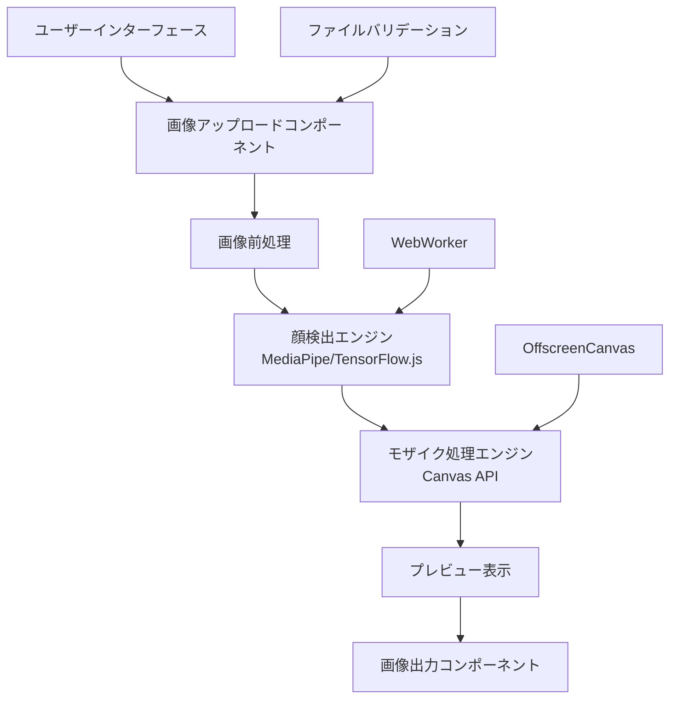
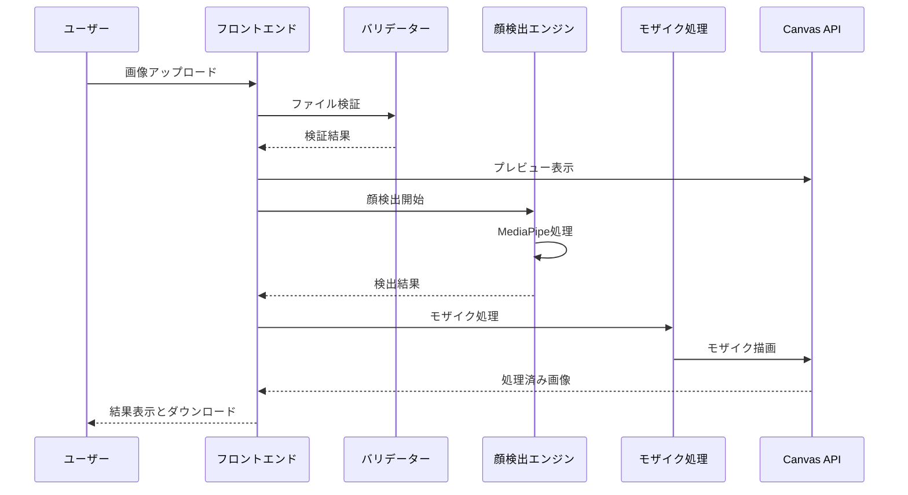
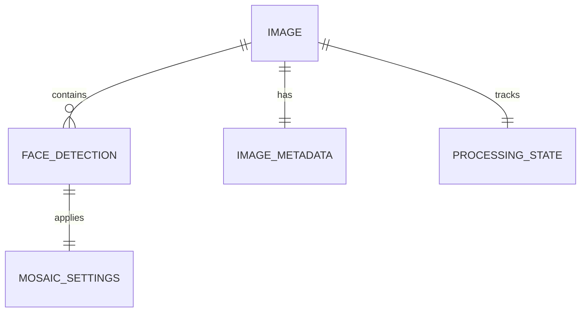
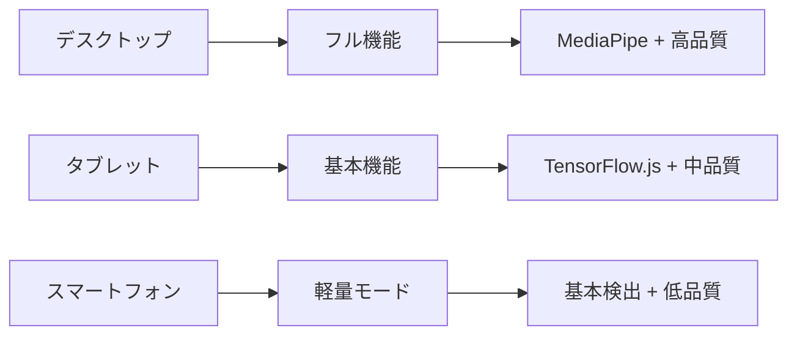
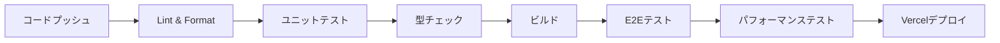

# 技術設計書

## 概要

このアプリケーションは、完全にクライアントサイドで動作する顔検出・モザイク処理システムです。ユーザーのプライバシーを最優先に、画像データが一切サーバーに送信されることなく、ブラウザ内でリアルタイムに顔検出とモザイク処理を実行します。調査結果に基づき、MediaPipeとTensorFlow.jsを組み合わせた高精度かつ高速な処理を実現します。

## 要件マッピング

### 設計コンポーネントトレーサビリティ
各設計コンポーネントは特定の要件に対応：
- **画像アップロードコンポーネント** → REQ-1.1-1.5: 画像入力機能
- **顔検出エンジン** → REQ-2.1-2.6: 顔検出機能
- **モザイク処理エンジン** → REQ-3.1-3.6: モザイク処理機能
- **画像出力コンポーネント** → REQ-4.1-4.5: 結果出力機能
- **ユーザーインターフェース** → REQ-5.1-5.6: UI要件
- **パフォーマンス最適化** → REQ-6.1-6.5: 性能・品質要件

### ユーザーストーリー対応
- **画像アップロード**: ドラッグ&ドロップとファイル選択による直感的な操作
- **自動顔検出**: MediaPipeによる98.6%精度の高速検出
- **モザイク処理**: Canvas APIによるリアルタイムプレビューと強度調整
- **結果出力**: 高解像度維持でのダウンロード機能
- **使いやすさ**: レスポンシブデザインとガイダンス表示
- **高品質処理**: 30秒以内の処理完了と95%以上の検出精度

## アーキテクチャ

### システム全体構成



### 技術スタック

調査結果に基づく最適な技術選定：

- **フロントエンド**: React 18 + TypeScript + Vite
- **顔検出**: MediaPipe Face Detection + TensorFlow.js (fallback)
- **画像処理**: HTML5 Canvas API + OffscreenCanvas
- **スタイリング**: Tailwind CSS + Framer Motion
- **テスト**: Vitest + React Testing Library + Playwright
- **デプロイメント**: Vercel (静的サイト)

### アーキテクチャ決定根拠

調査に基づく技術選択の理由：

- **MediaPipe選択理由**: 98.6%の高精度、リアルタイム処理最適化、ブラウザサポート
- **React + TypeScript**: 型安全性、コンポーネント再利用性、開発効率
- **完全クライアントサイド**: プライバシー保護、レスポンス速度、インフラコスト削減
- **Canvas API**: 高度な画像操作、モザイク効果実装、ブラウザ標準API

## データフロー

### 主要ユーザーフロー

画像処理の完全フローをシーケンス図で表示：



## コンポーネントとインターフェース

### バックエンドサービス（クライアントサイドモジュール）

完全にブラウザ内で動作するサービス群：

```typescript
class FaceDetectionService {
  async detectFaces(imageData: ImageData): Promise<FaceDetection[]>  // MediaPipe実行
  async initializeModel(): Promise<void>                            // モデル初期化
  validateImageSize(file: File): boolean                           // サイズ検証
}

class MosaicProcessingService {
  applyMosaic(canvas: HTMLCanvasElement, faces: FaceDetection[], intensity: number): void  // モザイク適用
  previewMosaic(canvas: HTMLCanvasElement, faces: FaceDetection[]): void                   // プレビュー生成
  adjustIntensity(level: 'weak' | 'medium' | 'strong'): number                            // 強度調整
}

class ImageProcessingService {
  resizeImage(image: HTMLImageElement, maxSize: number): HTMLCanvasElement     // リサイズ
  downloadImage(canvas: HTMLCanvasElement, filename: string): void            // ダウンロード
  validateFormat(file: File): boolean                                         // 形式検証
}
```

### フロントエンドコンポーネント

| コンポーネント名 | 責任 | Props/State概要 |
|------------------|------|-----------------|
| ImageUploader | ファイルアップロード、ドラッグ&ドロップ | file, onUpload, validation |
| FaceDetectionView | 顔検出結果表示、検出枠描画 | detectedFaces, isDetecting |
| MosaicControls | モザイク強度調整、プレビュー制御 | intensity, onIntensityChange |
| ProcessingProgress | 進行状況表示、エラーハンドリング | currentStep, progress, error |
| ImagePreview | 画像プレビュー、結果表示 | originalImage, processedImage |
| DownloadButton | 結果ダウンロード、ファイル名生成 | processedImage, originalFilename |

### API インターフェース（ブラウザ内）

クライアントサイド処理のためのインターフェース定義：

| 機能 | インターフェース | 目的 | 認証 | 戻り値 |
|------|------------------|------|------|--------|
| ファイル読み込み | FileReader API | 画像データ取得 | なし | ImageData, HTMLImageElement |
| 顔検出実行 | MediaPipe API | 顔位置検出 | なし | FaceDetection[] |
| モザイク処理 | Canvas 2D Context | 画像加工 | なし | 処理済みCanvas |
| 画像ダウンロード | Blob API | ファイル出力 | なし | Blob, URL |

## データモデル

### ドメインエンティティ

1. **FaceDetection**: 検出された顔の情報
2. **ImageMetadata**: アップロード画像のメタデータ
3. **ProcessingState**: 処理進行状況の管理
4. **MosaicSettings**: モザイク設定情報

### エンティティ関係



### データモデル定義

TypeScriptインターフェース：

```typescript
interface FaceDetection {
  id: string;
  boundingBox: {
    x: number;
    y: number;
    width: number;
    height: number;
  };
  confidence: number;
  landmarks?: Array<{x: number, y: number}>;
  createdAt: Date;
}

interface ImageMetadata {
  filename: string;
  size: number;
  width: number;
  height: number;
  format: 'jpeg' | 'png';
  uploadedAt: Date;
}

interface ProcessingState {
  currentStep: 'upload' | 'detecting' | 'processing' | 'complete';
  progress: number; // 0-100
  error?: string;
  detectedFaceCount?: number;
}

interface MosaicSettings {
  intensity: 'weak' | 'medium' | 'strong';
  pixelSize: number;
  appliedFaces: string[]; // FaceDetection IDs
}
```

### ローカルストレージスキーマ

ブラウザのlocalStorageを使用した設定保存：

```typescript
interface AppSettings {
  defaultMosaicIntensity: 'weak' | 'medium' | 'strong';
  maxFileSize: number;
  preferredOutputFormat: 'jpeg' | 'png';
  showTutorial: boolean;
}
```

## エラーハンドリング

### 包括的エラー処理戦略

```typescript
enum ErrorType {
  FILE_SIZE_EXCEEDED = 'FILE_SIZE_EXCEEDED',
  UNSUPPORTED_FORMAT = 'UNSUPPORTED_FORMAT',
  FACE_DETECTION_FAILED = 'FACE_DETECTION_FAILED',
  PROCESSING_TIMEOUT = 'PROCESSING_TIMEOUT',
  BROWSER_COMPATIBILITY = 'BROWSER_COMPATIBILITY'
}

interface AppError {
  type: ErrorType;
  message: string;
  userMessage: string;
  timestamp: Date;
  context?: Record<string, any>;
}
```

### エラー回復戦略

- **ファイルサイズエラー**: 自動リサイズ提案
- **形式エラー**: 対応形式の明示とコンバート提案
- **検出失敗**: 手動調整オプションの提供
- **ブラウザ非対応**: 推奨ブラウザの案内

## セキュリティ考慮事項

### プライバシー保護

- **完全ローカル処理**: 画像データがサーバーに送信されない
- **一時的メモリ使用**: 処理後の即座なメモリクリア
- **ローカルストレージ制限**: 設定のみ保存、画像は非永続化

### セキュリティベストプラクティス

- **入力検証**: ファイル形式、サイズ、マルウェアチェック
- **CSP設定**: Content Security Policyによる外部リソース制限
- **HTTPS必須**: セキュア通信の強制

## パフォーマンス・スケーラビリティ

### パフォーマンス目標

| メトリクス | 目標値 | 測定方法 |
|------------|--------|----------|
| 顔検出速度 | < 3秒 | 2MB画像での測定 |
| モザイク処理 | < 2秒 | 検出後のレンダリング |
| UIレスポンス | < 100ms | ユーザー操作への応答 |
| メモリ使用量 | < 200MB | Chrome DevToolsでの測定 |
| 初期ロード | < 5秒 | First Contentful Paint |

### 最適化戦略

- **OffscreenCanvas**: メインスレッドブロッキング回避
- **WebWorker**: 重い処理の並列実行
- **プログレッシブローディング**: モデルの段階的読み込み
- **メモリ管理**: 使用後のCanvas/ImageDataクリア

### 端末対応



## テスト戦略

### テストカバレッジ要件

- **ユニットテスト**: ≥85% コードカバレッジ
- **統合テスト**: 全コンポーネント間連携
- **E2Eテスト**: 主要ユーザージャーニー
- **パフォーマンステスト**: 様々な画像サイズでの負荷テスト

### テストアプローチ

1. **ユニットテスト**
   - 各サービスクラスの個別機能テスト
   - 画像処理ロジックの正確性検証
   - エラーハンドリングの網羅テスト

2. **統合テスト**
   - コンポーネント間のデータ受け渡し
   - Canvas APIとの連携
   - ブラウザAPI（FileReader、Blob）との統合

3. **E2Eテスト**
   - 画像アップロードから ダウンロードまでの完全フロー
   - 様々な画像形式・サイズでのテスト
   - エラーケースでのユーザー体験

4. **パフォーマンステスト**
   - 大きな画像ファイルでの処理速度
   - 複数顔検出時のメモリ使用量
   - 長時間使用でのメモリリーク検証

### CI/CDパイプライン



### ブラウザ互換性テスト

| ブラウザ | バージョン | 必須機能 | 代替手段 |
|----------|------------|----------|----------|
| Chrome | 90+ | MediaPipe | - |
| Firefox | 88+ | TensorFlow.js | Canvas fallback |
| Safari | 14+ | 基本Canvas | 軽量モード |
| Edge | 90+ | MediaPipe | - |

### 品質保証

- **自動テスト**: すべてのPRでの自動実行
- **手動テスト**: リリース前の包括的テスト
- **ユーザビリティテスト**: 実際のユーザーによる操作性確認
- **アクセシビリティ**: WCAG 2.1 AA準拠の確認