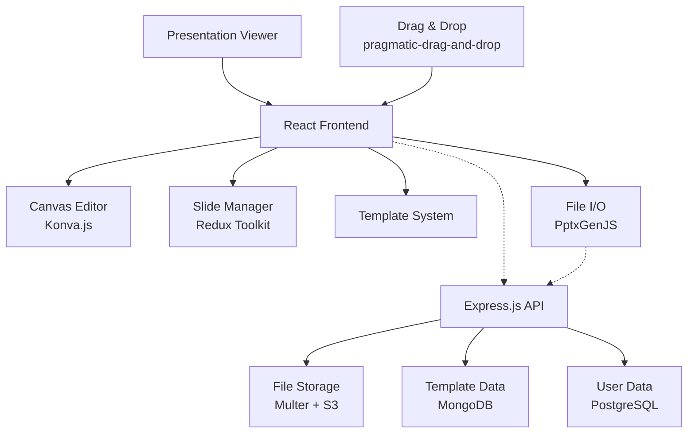
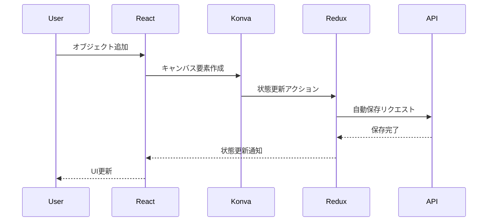
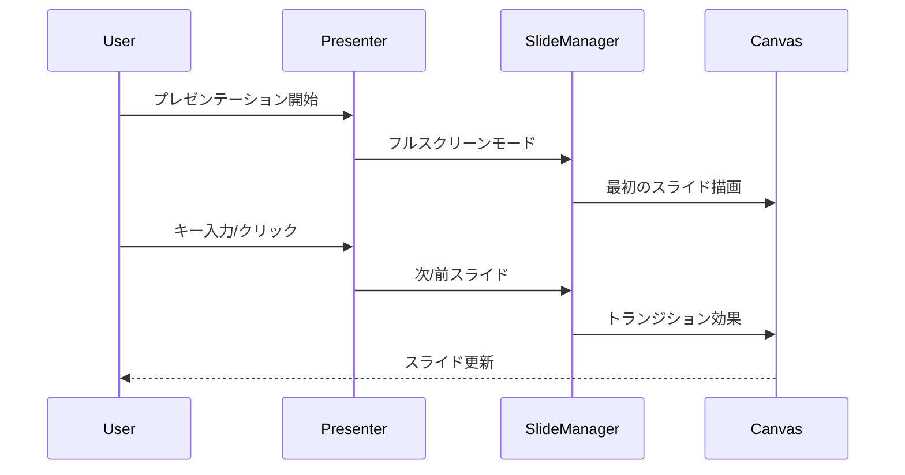
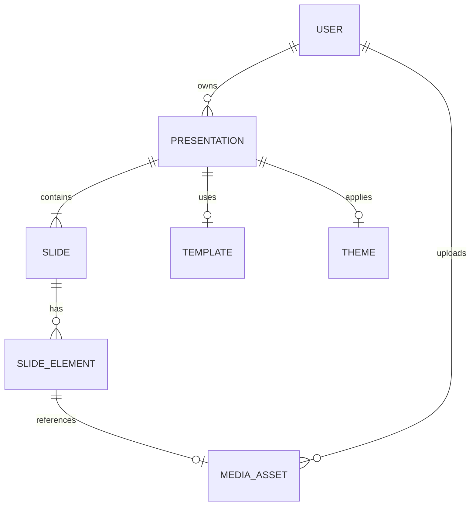
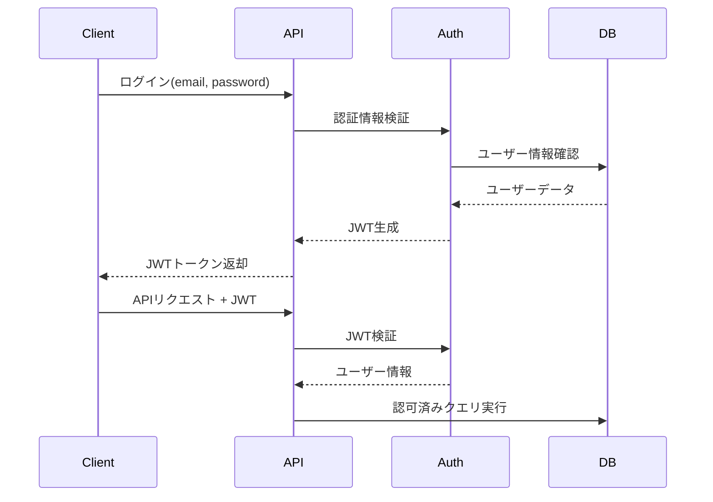
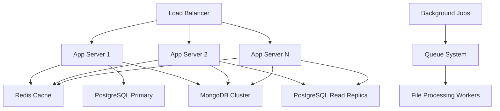
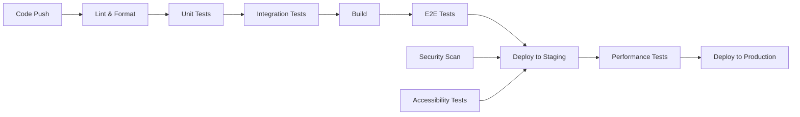

# 技術設計書

## 概要
PowerPointのようなスライド作成アプリケーションを開発するための包括的な技術設計。高性能なキャンバスベースの編集機能、直感的なドラッグ＆ドロップインターフェース、およびファイル互換性を重視したモダンなWeb技術スタックを採用。研究結果に基づき、プレゼンテーションエディターに最適化されたアーキテクチャを設計。

## 要件マッピング

### 設計コンポーネントのトレーサビリティ
各設計コンポーネントは特定の要件に対応：

- **スライド管理システム** → 要件1: スライド作成と管理（EARS 1.1-1.7）
- **キャンバスエディター** → 要件2: コンテンツ編集機能（EARS 2.1-2.8）
- **テンプレート/テーマシステム** → 要件3: スライドレイアウトとデザイン（EARS 3.1-3.7）
- **プレゼンテーションビューアー** → 要件4: プレゼンテーション実行モード（EARS 4.1-4.7）
- **ファイルI/Oシステム** → 要件5: ファイル管理機能（EARS 5.1-5.8）
- **UIフレームワーク** → 要件6: ユーザーインターフェースとナビゲーション（EARS 6.1-6.8）

### ユーザーストーリーの対応
全要件のユーザーストーリーに技術的解決策を提供：

- **プレゼンテーション作成者**: React + Konva.jsによる高性能キャンバスエディター
- **コンテンツ作成者**: リアルタイム編集とドラッグ＆ドロップサポート
- **デザイナー**: テンプレートシステムとテーマ管理機能
- **発表者**: フルスクリーンプレゼンテーションモードとナビゲーション
- **ユーザー**: ファイル管理とエクスポート機能
- **初心者ユーザー**: 直感的なUIとガイダンス機能

## アーキテクチャ



### 技術スタック
研究結果と要件分析に基づく技術選択：

- **Frontend**: React 18 + TypeScript + Vite
- **Canvas Library**: Konva.js（高性能アニメーション対応）
- **State Management**: Redux Toolkit（複雑な状態管理）
- **Drag & Drop**: pragmatic-drag-and-drop（フレームワーク非依存、高性能）
- **UI Components**: Mantine UI（豊富なコンポーネント）
- **File Processing**: PptxGenJS（PowerPoint互換性）
- **Backend**: Express.js + TypeScript
- **Database**: PostgreSQL（リレーショナルデータ） + MongoDB（テンプレート）
- **File Storage**: AWS S3（画像・メディア）
- **Authentication**: JWT + bcrypt
- **Testing**: Vitest + React Testing Library + Playwright
- **Deployment**: Docker + Vercel（Frontend） + Railway（Backend）

### アーキテクチャ決定の理由
研究に基づく技術選択の根拠：

- **Konva.js選択理由**: プレゼンテーションエディターにおける高性能要求（アニメーション、頻繁なオブジェクト更新）に最適。Fabric.jsより性能優位性あり
- **pragmatic-drag-and-drop選択理由**: フレームワーク非依存でネイティブHTML5 DnD APIベース、Atlassian製で信頼性高
- **Redux Toolkit選択理由**: 複雑なスライド状態管理、Undo/Redo機能、複数コンポーネント間での状態共有が必要
- **PptxGenJS選択理由**: 業界標準のPowerPoint互換性、ブラウザー直接動作、ゼロランタイム依存
- **PostgreSQL + MongoDB選択理由**: ユーザーデータにはACID特性、テンプレートには柔軟なスキーマが最適

## データフロー

### 主要ユーザーフローのシーケンス図

#### スライド編集フロー


#### プレゼンテーション実行フロー


## コンポーネントとインターフェース

### バックエンドサービス・メソッドシグネチャ

```typescript
class PresentationService {
  // プレゼンテーション管理
  async createPresentation(userId: string, templateId?: string): Promise<Presentation>
  async updatePresentation(id: string, data: PresentationUpdate): Promise<Presentation>
  async deletePresentation(id: string): Promise<void>
  async getPresentation(id: string): Promise<Presentation>
  async listPresentations(userId: string): Promise<Presentation[]>
  
  // スライド操作
  async addSlide(presentationId: string, position: number): Promise<Slide>
  async deleteSlide(slideId: string): Promise<void>
  async reorderSlides(presentationId: string, slideIds: string[]): Promise<void>
  async updateSlideContent(slideId: string, content: SlideContent): Promise<Slide>
}

class FileService {
  // ファイルI/O
  async savePresentation(presentation: Presentation): Promise<string>
  async loadPresentation(fileId: string): Promise<Presentation>
  async exportToPptx(presentationId: string): Promise<Buffer>
  async exportToPdf(presentationId: string): Promise<Buffer>
  async uploadMedia(file: Buffer, type: string): Promise<MediaAsset>
}

class TemplateService {
  // テンプレート管理
  async getTemplates(): Promise<Template[]>
  async applyTemplate(presentationId: string, templateId: string): Promise<void>
  async updateTheme(presentationId: string, theme: Theme): Promise<void>
}
```

### フロントエンドコンポーネント

| コンポーネント名 | 責任 | Props/State概要 |
|----------------|------|----------------|
| **PresentationEditor** | メインエディター画面 | presentationId, mode |
| **SlideCanvas** | Konva.jsキャンバス編集 | slide, onUpdate, tools |
| **SlideThumbnail** | スライドサムネイル表示 | slide, selected, onSelect |
| **SlidePanel** | スライド一覧とナビゲーション | slides, currentSlide, onReorder |
| **ToolBar** | 編集ツールバー | activeTools, onToolSelect |
| **PropertyPanel** | オブジェクトプロパティ編集 | selectedObject, onChange |
| **TemplateSelector** | テンプレート選択 | templates, onSelect |
| **PresentationViewer** | プレゼンテーション実行 | presentation, currentSlide |
| **FileManager** | ファイル操作UI | onSave, onLoad, onExport |

### APIエンドポイント

| Method | Route | Purpose | Auth | Status Codes |
|--------|-------|---------|------|--------------|
| GET    | /api/presentations | プレゼンテーション一覧取得 | Required | 200, 401, 500 |
| POST   | /api/presentations | 新規プレゼンテーション作成 | Required | 201, 400, 401, 500 |
| GET    | /api/presentations/:id | プレゼンテーション詳細取得 | Required | 200, 401, 404, 500 |
| PUT    | /api/presentations/:id | プレゼンテーション更新 | Required | 200, 400, 401, 404, 500 |
| DELETE | /api/presentations/:id | プレゼンテーション削除 | Required | 204, 401, 404, 500 |
| POST   | /api/presentations/:id/slides | スライド追加 | Required | 201, 400, 401, 404, 500 |
| PUT    | /api/slides/:id | スライド更新 | Required | 200, 400, 401, 404, 500 |
| DELETE | /api/slides/:id | スライド削除 | Required | 204, 401, 404, 500 |
| POST   | /api/presentations/:id/reorder | スライド並び替え | Required | 200, 400, 401, 404, 500 |
| GET    | /api/templates | テンプレート一覧取得 | Optional | 200, 500 |
| POST   | /api/presentations/:id/export/pptx | PPTX形式エクスポート | Required | 200, 401, 404, 500 |
| POST   | /api/presentations/:id/export/pdf | PDF形式エクスポート | Required | 200, 401, 404, 500 |
| POST   | /api/media/upload | メディアファイルアップロード | Required | 201, 400, 401, 413, 500 |

## データモデル

### ドメインエンティティ
1. **Presentation**: プレゼンテーション全体の情報
2. **Slide**: 個別スライドの内容とレイアウト
3. **SlideElement**: テキスト、画像、図形などの要素
4. **Template**: デザインテンプレートとレイアウト
5. **Theme**: カラーパレットとフォント設定
6. **MediaAsset**: 画像・動画などのメディアファイル
7. **User**: ユーザー情報と認証

### エンティティ関係図


### データモデル定義

```typescript
interface Presentation {
  id: string;
  title: string;
  description?: string;
  ownerId: string;
  templateId?: string;
  themeId?: string;
  slideIds: string[];
  settings: PresentationSettings;
  createdAt: Date;
  updatedAt: Date;
}

interface Slide {
  id: string;
  presentationId: string;
  order: number;
  layoutType: LayoutType;
  elements: SlideElement[];
  background: Background;
  notes?: string;
  transitions: TransitionEffect[];
  createdAt: Date;
  updatedAt: Date;
}

interface SlideElement {
  id: string;
  type: ElementType; // 'text' | 'image' | 'shape' | 'chart'
  position: Position;
  size: Size;
  style: ElementStyle;
  content: ElementContent;
  animations: Animation[];
  zIndex: number;
}

interface Template {
  id: string;
  name: string;
  category: string;
  layoutOptions: Layout[];
  defaultTheme: Theme;
  previewImage: string;
  isPublic: boolean;
}

interface Theme {
  id: string;
  name: string;
  colorPalette: ColorPalette;
  fontFamily: FontSettings;
  spacing: SpacingSettings;
}
```

```python
from dataclasses import dataclass
from datetime import datetime
from typing import List, Optional, Dict, Any

@dataclass
class Presentation:
    id: str
    title: str
    owner_id: str
    template_id: Optional[str]
    theme_id: Optional[str]
    slide_ids: List[str]
    settings: Dict[str, Any]
    created_at: datetime
    updated_at: datetime

@dataclass
class Slide:
    id: str
    presentation_id: str
    order: int
    layout_type: str
    elements: List[Dict[str, Any]]
    background: Dict[str, Any]
    notes: Optional[str]
    created_at: datetime
    updated_at: datetime
```

### データベーススキーマ

#### PostgreSQL（ユーザー・プレゼンテーション管理）
```sql
CREATE TABLE users (
    id UUID PRIMARY KEY DEFAULT gen_random_uuid(),
    email VARCHAR(255) UNIQUE NOT NULL,
    password_hash VARCHAR(255) NOT NULL,
    name VARCHAR(100) NOT NULL,
    created_at TIMESTAMP DEFAULT NOW(),
    updated_at TIMESTAMP DEFAULT NOW()
);

CREATE TABLE presentations (
    id UUID PRIMARY KEY DEFAULT gen_random_uuid(),
    title VARCHAR(255) NOT NULL,
    description TEXT,
    owner_id UUID NOT NULL REFERENCES users(id) ON DELETE CASCADE,
    template_id UUID,
    theme_id UUID,
    settings JSONB DEFAULT '{}',
    created_at TIMESTAMP DEFAULT NOW(),
    updated_at TIMESTAMP DEFAULT NOW()
);

CREATE TABLE slides (
    id UUID PRIMARY KEY DEFAULT gen_random_uuid(),
    presentation_id UUID NOT NULL REFERENCES presentations(id) ON DELETE CASCADE,
    order_index INTEGER NOT NULL,
    layout_type VARCHAR(50) NOT NULL,
    elements JSONB DEFAULT '[]',
    background JSONB DEFAULT '{}',
    notes TEXT,
    created_at TIMESTAMP DEFAULT NOW(),
    updated_at TIMESTAMP DEFAULT NOW(),
    UNIQUE(presentation_id, order_index)
);

CREATE INDEX idx_presentations_owner ON presentations(owner_id);
CREATE INDEX idx_slides_presentation ON slides(presentation_id);
```

#### MongoDB（テンプレート・テーマ管理）
```javascript
// templates collection
{
  _id: ObjectId,
  name: String,
  category: String,
  layoutOptions: [
    {
      type: String,
      areas: [
        { type: String, x: Number, y: Number, width: Number, height: Number }
      ]
    }
  ],
  defaultTheme: {
    colorPalette: {
      primary: String,
      secondary: String,
      accent: String,
      background: String,
      text: String
    },
    fontFamily: {
      heading: String,
      body: String
    }
  },
  previewImage: String,
  isPublic: Boolean,
  createdAt: Date,
  updatedAt: Date
}
```

### マイグレーション戦略
- **段階的マイグレーション**: PostgreSQLスキーマ変更の段階実装
- **後方互換性**: 既存ファイル形式との互換性維持
- **データ変換**: レガシーフォーマットからの移行ツール
- **インデックス戦略**: クエリパフォーマンス最適化のためのインデックス設計

## エラーハンドリング

### エラー階層とハンドリング戦略

```typescript
// カスタムエラークラス
class PresentationError extends Error {
  constructor(message: string, public code: string, public statusCode: number) {
    super(message);
  }
}

class ValidationError extends PresentationError {
  constructor(field: string, message: string) {
    super(`Validation failed for ${field}: ${message}`, 'VALIDATION_ERROR', 400);
  }
}

class FileProcessingError extends PresentationError {
  constructor(message: string) {
    super(message, 'FILE_PROCESSING_ERROR', 422);
  }
}

// エラーハンドラーミドルウェア
const errorHandler = (error: Error, req: Request, res: Response, next: NextFunction) => {
  if (error instanceof PresentationError) {
    return res.status(error.statusCode).json({
      error: {
        code: error.code,
        message: error.message,
        timestamp: new Date().toISOString()
      }
    });
  }
  
  // 未知のエラー
  console.error('Unexpected error:', error);
  return res.status(500).json({
    error: {
      code: 'INTERNAL_SERVER_ERROR',
      message: 'An unexpected error occurred',
      timestamp: new Date().toISOString()
    }
  });
};
```

### フロントエンドエラーハンドリング

```typescript
// React Error Boundary
class ErrorBoundary extends Component<Props, State> {
  static getDerivedStateFromError(error: Error) {
    return { hasError: true, error };
  }

  componentDidCatch(error: Error, errorInfo: ErrorInfo) {
    console.error('Canvas error:', error, errorInfo);
    // エラーレポーティングサービスに送信
  }

  render() {
    if (this.state.hasError) {
      return <ErrorFallback error={this.state.error} />;
    }
    return this.props.children;
  }
}

// Konva.jsエラーハンドリング
const handleCanvasError = (error: KonvaError) => {
  console.error('Canvas operation failed:', error);
  toast.error('編集操作に失敗しました。もう一度お試しください。');
  // 自動復旧ロジック
};
```

## セキュリティ考慮事項

### 認証・認可


### 認可マトリックス
| 役割 | プレゼンテーション作成 | 編集 | 削除 | 共有 | テンプレート管理 |
|------|---------------------|------|------|------|-----------------|
| **オーナー** | ✓ | ✓ | ✓ | ✓ | × |
| **編集者** | × | ✓ | × | × | × |
| **閲覧者** | × | × | × | × | × |
| **管理者** | ✓ | ✓ | ✓ | ✓ | ✓ |

### データ保護
```typescript
// 入力検証
import { body, param, validationResult } from 'express-validator';

const validatePresentationInput = [
  body('title').isLength({ min: 1, max: 255 }).escape(),
  body('description').optional().isLength({ max: 1000 }).escape(),
  body('elements.*.content').isLength({ max: 10000 }).escape(),
  (req: Request, res: Response, next: NextFunction) => {
    const errors = validationResult(req);
    if (!errors.isEmpty()) {
      return res.status(400).json({ errors: errors.array() });
    }
    next();
  }
];

// ファイルアップロード制限
const uploadLimits = {
  fileSize: 10 * 1024 * 1024, // 10MB
  allowedTypes: ['image/jpeg', 'image/png', 'image/gif'],
  maxFiles: 50
};
```

### セキュリティベストプラクティス
- **OWASP Top 10対策**: SQL Injection、XSS、CSRF対策実装
- **API Rate Limiting**: `express-rate-limit`によるDDoS防御
- **CORS設定**: オリジン制限とプリフライトリクエスト対応
- **セキュリティヘッダー**: `helmet`によるセキュリティヘッダー設定

```typescript
// セキュリティミドルウェア設定
app.use(helmet({
  contentSecurityPolicy: {
    directives: {
      defaultSrc: ["'self'"],
      styleSrc: ["'self'", "'unsafe-inline'"],
      scriptSrc: ["'self'"],
      imgSrc: ["'self'", "data:", "https:"],
    },
  },
}));

app.use(rateLimit({
  windowMs: 15 * 60 * 1000, // 15分
  max: 1000, // リクエスト数制限
  message: 'Too many requests, please try again later',
}));
```

## パフォーマンス・スケーラビリティ

### パフォーマンス目標

| メトリック | 目標値 | 測定方法 |
|-----------|--------|----------|
| 応答時間(p95) | < 200ms | APIエンドポイント |
| 応答時間(p99) | < 500ms | APIエンドポイント |
| スループット | > 1000 req/sec | 負荷テスト |
| データベースクエリ(p99) | < 50ms | クエリ監視 |
| 同時ユーザー数 | > 10,000 | システム容量 |
| キャンバス描画性能 | 60 FPS | フロントエンド監視 |

### キャッシュ戦略
```typescript
// Redis キャッシュ設定
const cacheConfig = {
  // ブラウザーキャッシュ
  staticAssets: '1 year',
  apiResponses: '5 minutes',
  
  // CDN
  mediaFiles: '30 days',
  staticContent: '7 days',
  
  // アプリケーションキャッシュ
  sessionData: '24 hours',
  templateData: '1 hour',
  
  // データベースキャッシュ
  queryResults: '10 minutes',
  userProfiles: '30 minutes'
};

// Konva.jsパフォーマンス最適化
const optimizeCanvas = () => {
  // レイヤー分離による描画最適化
  const backgroundLayer = new Konva.Layer();
  const contentLayer = new Konva.Layer();
  const uiLayer = new Konva.Layer();
  
  // 形状キャッシュ有効化
  complexShape.cache();
  
  // 不要な再描画防止
  layer.batchDraw();
};
```

### スケーラビリティアプローチ


- **水平スケーリング**: アプリケーションサーバーの自動スケーリング
- **読み込みレプリカ**: データベース読み込み分散
- **バックグラウンドジョブ**: ファイル処理とエクスポートの非同期処理
- **自動スケーリング**: 負荷メトリックベースのスケーリング

## テスト戦略

### テストカバレッジ要件
- **ユニットテスト**: ≥80% コードカバレッジ
- **統合テスト**: 全APIエンドポイントと外部統合
- **E2Eテスト**: 重要なユーザージャーニー
- **パフォーマンステスト**: 予想ピーク負荷の2倍での負荷テスト

### テストアプローチ

#### 1. ユニットテスト
```typescript
// React コンポーネントテスト
import { render, fireEvent, waitFor } from '@testing-library/react';
import { SlideCanvas } from '../SlideCanvas';

describe('SlideCanvas', () => {
  it('should add text element when text tool is selected', async () => {
    const mockOnUpdate = vi.fn();
    const { getByTestId } = render(
      <SlideCanvas slide={mockSlide} onUpdate={mockOnUpdate} tool="text" />
    );
    
    fireEvent.click(getByTestId('canvas'));
    
    await waitFor(() => {
      expect(mockOnUpdate).toHaveBeenCalledWith(
        expect.objectContaining({
          elements: expect.arrayContaining([
            expect.objectContaining({ type: 'text' })
          ])
        })
      );
    });
  });
});

// ビジネスロジックテスト
describe('PresentationService', () => {
  it('should prevent deletion of last slide', async () => {
    const presentation = createMockPresentation({ slideCount: 1 });
    
    await expect(
      presentationService.deleteSlide(presentation.slideIds[0])
    ).rejects.toThrow('Cannot delete the last slide');
  });
});
```

#### 2. 統合テスト
```typescript
// API統合テスト
describe('Presentation API', () => {
  it('should create presentation with template', async () => {
    const response = await request(app)
      .post('/api/presentations')
      .set('Authorization', `Bearer ${authToken}`)
      .send({
        title: 'Test Presentation',
        templateId: 'template-1'
      })
      .expect(201);
    
    expect(response.body).toHaveProperty('id');
    expect(response.body.templateId).toBe('template-1');
  });
});
```

#### 3. E2Eテスト
```typescript
// Playwright E2Eテスト
import { test, expect } from '@playwright/test';

test('complete presentation creation flow', async ({ page }) => {
  await page.goto('/editor');
  
  // 新規プレゼンテーション作成
  await page.click('[data-testid="new-presentation"]');
  await page.fill('[data-testid="title-input"]', 'My Presentation');
  
  // スライド追加
  await page.click('[data-testid="add-slide"]');
  await expect(page.locator('[data-testid="slide-thumbnail"]')).toHaveCount(2);
  
  // テキスト追加
  await page.click('[data-testid="text-tool"]');
  await page.click('[data-testid="slide-canvas"]');
  await page.fill('[data-testid="text-input"]', 'Hello World');
  
  // 保存
  await page.click('[data-testid="save-button"]');
  await expect(page.locator('[data-testid="save-success"]')).toBeVisible();
});
```

#### 4. パフォーマンステスト
```javascript
// k6負荷テストスクリプト
import http from 'k6/http';
import { check, sleep } from 'k6';

export let options = {
  stages: [
    { duration: '5m', target: 100 }, // 段階的負荷増加
    { duration: '10m', target: 1000 }, // 目標負荷維持
    { duration: '5m', target: 0 }, // 負荷減少
  ],
  thresholds: {
    http_req_duration: ['p(95)<200'], // 95%のリクエストが200ms未満
    http_req_failed: ['rate<0.01'], // エラー率1%未満
  },
};

export default function () {
  const response = http.get('http://localhost:3000/api/presentations', {
    headers: { Authorization: `Bearer ${__ENV.AUTH_TOKEN}` },
  });
  
  check(response, {
    'status is 200': (r) => r.status === 200,
    'response time < 200ms': (r) => r.timings.duration < 200,
  });
  
  sleep(1);
}
```

### CI/CDパイプライン


### テスト自動化
- **プルリクエスト**: 自動テスト実行とカバレッジレポート
- **ステージング**: E2Eテストとパフォーマンステストの自動実行
- **プロダクション**: デプロイ後のスモークテスト
- **監視**: 本番環境での継続的パフォーマンス監視