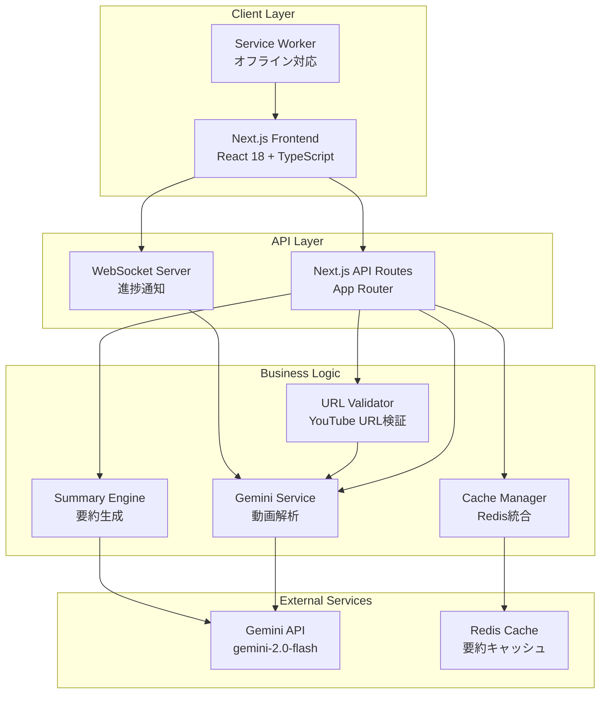
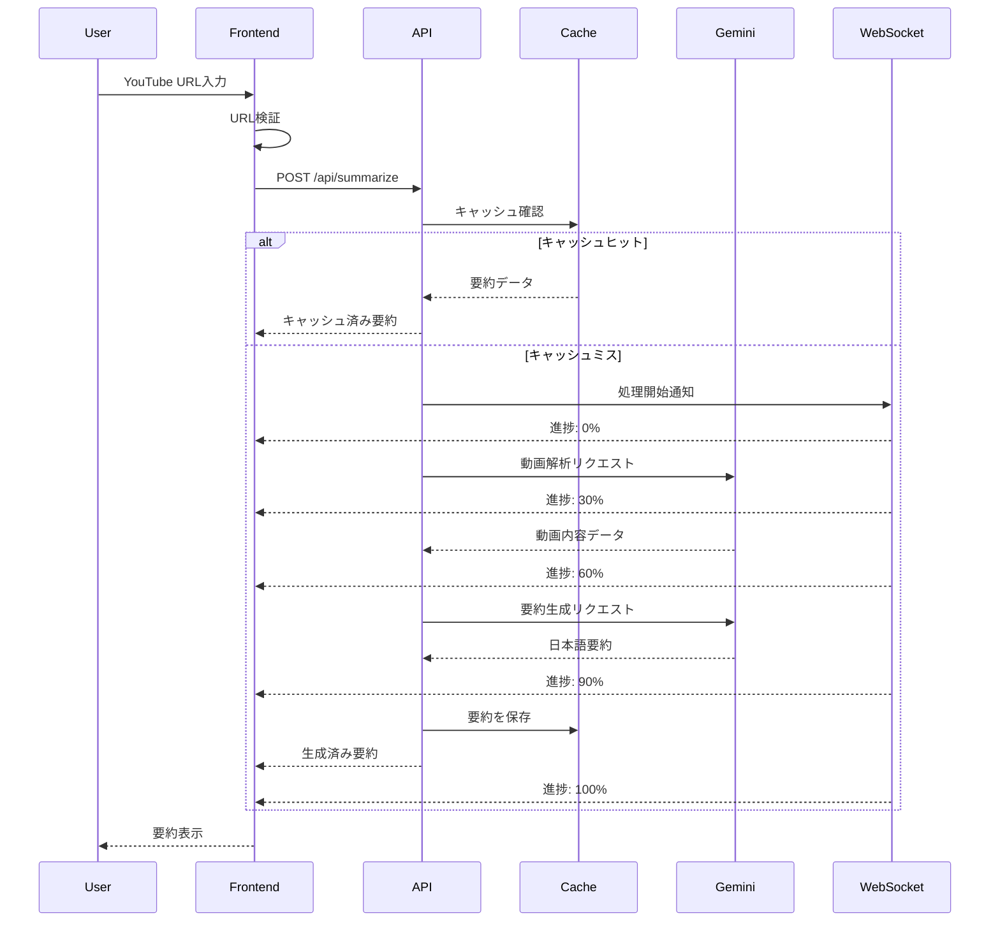
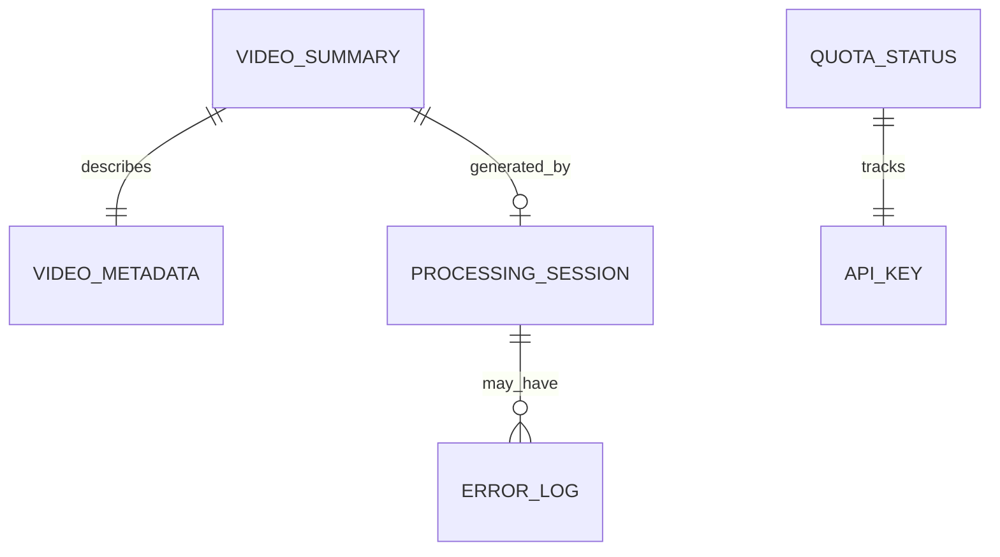
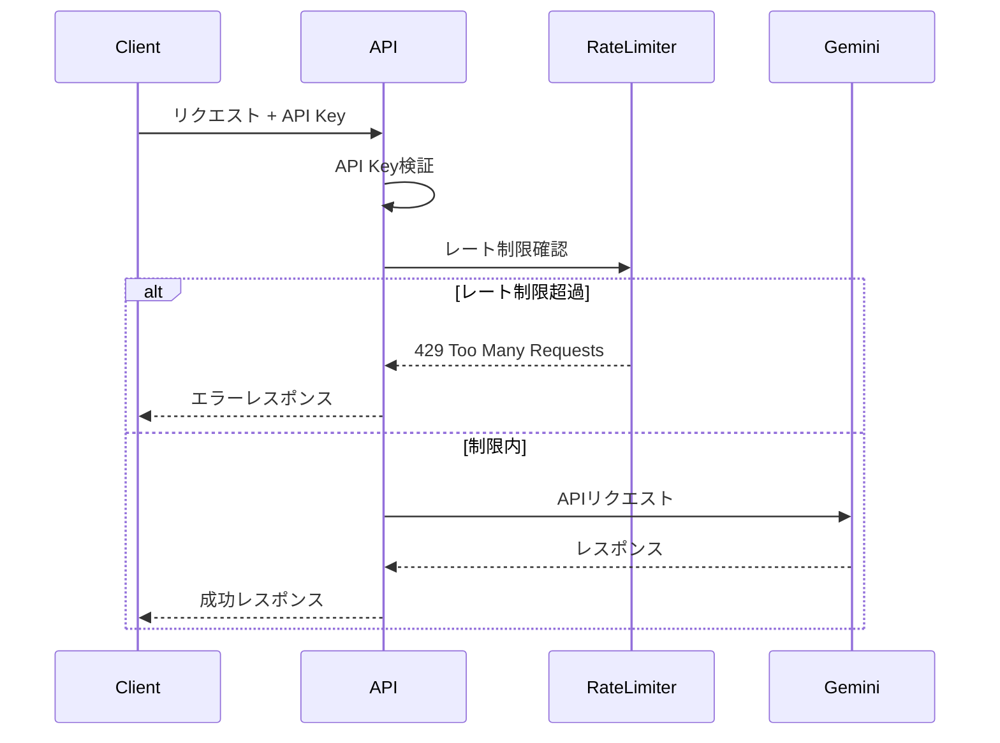
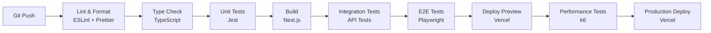

# Technical Design

## Overview
YouTube動画要約アプリケーションは、Next.js 15とTypeScriptを使用してモダンなWebアプリケーションとして実装します。Google Gemini APIの動画理解機能を活用し、YouTube URLから直接動画内容を解析し、日本語の要約を生成します。リアルタイムの進捗表示とキャッシュ機能により、高速で効率的なユーザー体験を提供します。

## Requirements Mapping

### Design Component Traceability
各設計コンポーネントが対応する要件：
- **URLバリデーション層** → REQ-1.1, 1.2, 1.3, 1.5: YouTube URL入力と検証
- **Gemini API統合** → REQ-2.1, 2.4, 2.5: 動画解析とAPI制限管理
- **要約生成エンジン** → REQ-3.1, 3.2, 3.3, 3.4: 日本語要約と構造化出力
- **エラーハンドリングミドルウェア** → REQ-4.1, 4.2, 4.3, 4.5: 包括的なエラー処理
- **UIコンポーネント** → REQ-5.1, 5.2, 5.3, 5.4, 5.5: レスポンシブインターフェース
- **キャッシュ層** → REQ-6.4: 同一動画のキャッシュ処理
- **パフォーマンス最適化** → REQ-6.1, 6.2, 6.3, 6.5: 応答時間と並行処理

### User Story Coverage
- **URL入力ストーリー**: フロントエンドの入力フォームとバリデーションロジックで実現
- **動画解析ストーリー**: Gemini API統合とWebSocket進捗通知で対応
- **要約生成ストーリー**: 構造化プロンプトと日本語特化処理で実装
- **エラー対応ストーリー**: 統一エラーハンドラーと再試行メカニズムで解決
- **UI/UXストーリー**: Next.jsのApp RouterとTailwind CSSで実現
- **パフォーマンスストーリー**: Redis キャッシュとストリーミングレスポンスで最適化

## Architecture



### Technology Stack
調査結果に基づく技術選定：

- **Frontend**: Next.js 15 + TypeScript + React 18
- **スタイリング**: Tailwind CSS + @tailwindcss/typography
- **Backend**: Next.js API Routes (App Router)
- **AI統合**: @google/generative-ai (Gemini 2.0 Flash)
- **キャッシュ**: Redis (Upstash Redis)
- **状態管理**: Zustand
- **リアルタイム通信**: Socket.io
- **Testing**: Jest + React Testing Library + Playwright
- **Deployment**: Vercel + Vercel KV (Redis)

### Architecture Decision Rationale

- **Why Next.js 15**: 最新のApp Router、React Server Components、優れたTypeScript統合、Vercelとの親和性
- **Why Gemini 2.0 Flash**: YouTube URL直接サポート、日本語対応、高速処理、無料枠の存在
- **Why Redis**: 要約キャッシュの高速アクセス、TTL設定、Vercel KVとの統合
- **Why WebSocket**: リアルタイム進捗通知、長時間処理の状態管理
- **Why Tailwind CSS**: 高速開発、レスポンシブ対応、カスタマイズ性

## Data Flow

### Primary User Flow: 動画要約生成



## Components and Interfaces

### Backend Services & Method Signatures

```typescript
// URLバリデーションサービス
class URLValidationService {
  validateYouTubeURL(url: string): ValidationResult     // YouTube URL検証
  normalizeURL(url: string): string                     // 短縮URLの正規化
  extractVideoId(url: string): string                   // 動画ID抽出
}

// Gemini API統合サービス
class GeminiService {
  async analyzeVideo(videoUrl: string): Promise<VideoAnalysis>      // 動画解析
  async generateSummary(analysis: VideoAnalysis): Promise<Summary>  // 要約生成
  checkQuotaStatus(): Promise<QuotaStatus>                         // クォータ確認
}

// キャッシュ管理サービス
class CacheService {
  async get(videoId: string): Promise<Summary | null>              // キャッシュ取得
  async set(videoId: string, summary: Summary): Promise<void>      // キャッシュ保存
  async invalidate(videoId: string): Promise<void>                 // キャッシュ削除
}

// 進捗通知サービス
class ProgressService {
  notifyProgress(sessionId: string, progress: number): void        // 進捗送信
  createSession(): string                                           // セッション作成
  closeSession(sessionId: string): void                           // セッション終了
}
```

### Frontend Components

| Component Name | Responsibility | Props/State Summary |
|----------------|----------------|---------------------|
| URLInputForm | YouTube URL入力フォーム | url, onSubmit, isLoading, error |
| SummaryDisplay | 要約結果表示 | summary, isLoading, onCopy |
| ProgressIndicator | 進捗状況表示 | progress, status, estimatedTime |
| ErrorBoundary | エラー表示とリトライ | error, onRetry, suggestion |
| CopyButton | クリップボードコピー | text, onCopy, copiedState |
| SummaryOptions | 要約オプション選択 | mode (simple/detailed), onChange |
| Header | アプリケーションヘッダー | title, navigation |
| Footer | フッター情報 | version, links |

### API Endpoints

| Method | Route | Purpose | Auth | Status Codes |
|--------|-------|---------|------|--------------|
| POST | /api/summarize | 動画要約生成 | API Key | 200, 400, 401, 429, 500 |
| GET | /api/summarize/:videoId | キャッシュ済み要約取得 | Optional | 200, 404, 500 |
| GET | /api/quota | API使用状況確認 | API Key | 200, 401, 500 |
| GET | /api/health | ヘルスチェック | None | 200, 503 |
| WS | /ws/progress | 進捗通知WebSocket | Session | 101, 400 |

## Data Models

### Domain Entities
1. **VideoSummary**: 生成された要約情報
2. **VideoMetadata**: YouTube動画のメタデータ
3. **ProcessingSession**: 処理セッション情報
4. **QuotaStatus**: API使用状況
5. **ErrorLog**: エラー記録

### Entity Relationships


### Data Model Definitions

```typescript
// 動画要約モデル
interface VideoSummary {
  id: string;
  videoId: string;
  url: string;
  title: string;
  summary: {
    brief: string;        // 200-500文字の要約
    detailed?: string;    // 詳細版要約
    topics: string[];     // 主要トピック
    keyPoints: string[];  // キーポイント
    conclusion: string;   // 結論
  };
  metadata: VideoMetadata;
  createdAt: Date;
  expiresAt: Date;       // キャッシュ有効期限
}

// 動画メタデータ
interface VideoMetadata {
  duration: number;      // 秒単位
  uploadDate: Date;
  channelName: string;
  viewCount: number;
  language: string;
}

// 処理セッション
interface ProcessingSession {
  sessionId: string;
  videoId: string;
  status: 'pending' | 'processing' | 'completed' | 'failed';
  progress: number;      // 0-100
  startedAt: Date;
  completedAt?: Date;
  error?: ErrorInfo;
}

// エラー情報
interface ErrorInfo {
  code: string;
  message: string;
  details?: any;
  retryable: boolean;
  suggestedAction?: string;
}
```

### Database Schema
Redis データ構造：

```typescript
// キー設計
const KEYS = {
  summary: (videoId: string) => `summary:${videoId}`,
  session: (sessionId: string) => `session:${sessionId}`,
  quota: (apiKey: string) => `quota:${apiKey}`,
  rateLimiter: (ip: string) => `rate:${ip}`,
};

// TTL設定
const TTL = {
  summary: 7 * 24 * 60 * 60,     // 7日間
  session: 60 * 60,              // 1時間
  quota: 60 * 60,                // 1時間
  rateLimiter: 60,               // 1分
};
```

## Error Handling

### エラー分類と処理戦略

```typescript
enum ErrorCode {
  // 入力検証エラー (400系)
  INVALID_URL = 'INVALID_URL',
  URL_NOT_YOUTUBE = 'URL_NOT_YOUTUBE',
  
  // API制限エラー (429)
  QUOTA_EXCEEDED = 'QUOTA_EXCEEDED',
  RATE_LIMITED = 'RATE_LIMITED',
  
  // 外部サービスエラー (500系)
  GEMINI_API_ERROR = 'GEMINI_API_ERROR',
  VIDEO_UNAVAILABLE = 'VIDEO_UNAVAILABLE',
  
  // システムエラー
  CACHE_ERROR = 'CACHE_ERROR',
  NETWORK_ERROR = 'NETWORK_ERROR',
  TIMEOUT_ERROR = 'TIMEOUT_ERROR',
}

// 統一エラーハンドラー
class ErrorHandler {
  handle(error: AppError): ErrorResponse {
    const handler = this.errorHandlers[error.code] || this.defaultHandler;
    return handler(error);
  }
  
  private errorHandlers = {
    [ErrorCode.QUOTA_EXCEEDED]: (error) => ({
      message: 'API利用制限に達しました。しばらく後にお試しください。',
      retryAfter: 3600,
      showUpgrade: true,
    }),
    [ErrorCode.VIDEO_UNAVAILABLE]: (error) => ({
      message: '指定された動画は利用できません。URLを確認してください。',
      suggestions: ['動画が公開されているか確認', '別の動画URLを試す'],
    }),
    // ... 他のエラーハンドラー
  };
}
```

## Security Considerations

### Authentication & Authorization



### Data Protection
- **環境変数管理**: Gemini API キーは環境変数で管理
- **CORS設定**: 許可されたオリジンのみアクセス可能
- **入力サニタイゼーション**: XSS対策のための入力検証
- **HTTPSのみ**: 全通信をHTTPS化
- **CSP設定**: Content Security Policy実装

## Performance & Scalability

### Performance Targets
| Metric | Target | Measurement |
|--------|--------|-------------|
| Response Time (p95) | < 200ms | キャッシュヒット時 |
| Response Time (p99) | < 500ms | API エンドポイント |
| 要約生成時間（短い動画） | < 30秒 | 10分未満の動画 |
| 要約生成時間（中程度） | < 60秒 | 10-30分の動画 |
| 同時接続数 | > 1,000 | WebSocket接続 |

### Caching Strategy
- **ブラウザキャッシュ**: Service Workerによる静的アセット
- **CDN**: Vercel Edge Networkによる配信
- **アプリケーションキャッシュ**: Redis（Vercel KV）
- **API レスポンスキャッシュ**: 7日間のTTL設定

### Scalability Approach
- Vercelの自動スケーリング機能を活用
- Edge Functionsによる地理的分散
- Redis クラスタリングでキャッシュ容量拡張
- Gemini APIの並列リクエスト最適化

## Testing Strategy

### Test Coverage Requirements
- **Unit Tests**: ≥85% コードカバレッジ
- **Integration Tests**: 全APIエンドポイント
- **E2E Tests**: 主要ユーザーフロー
- **Performance Tests**: 予想ピークの2倍負荷

### Testing Approach

```typescript
// ユニットテスト例
describe('URLValidationService', () => {
  it('should validate correct YouTube URLs', () => {
    const valid = [
      'https://www.youtube.com/watch?v=dQw4w9WgXcQ',
      'https://youtu.be/dQw4w9WgXcQ',
      'https://m.youtube.com/watch?v=dQw4w9WgXcQ',
    ];
    valid.forEach(url => {
      expect(validator.validateYouTubeURL(url).isValid).toBe(true);
    });
  });
});

// E2Eテスト例
test('complete video summarization flow', async ({ page }) => {
  await page.goto('/');
  await page.fill('[data-testid="url-input"]', TEST_VIDEO_URL);
  await page.click('[data-testid="submit-button"]');
  await expect(page.locator('[data-testid="progress"]')).toBeVisible();
  await expect(page.locator('[data-testid="summary"]')).toBeVisible({ timeout: 60000 });
});
```

### CI/CD Pipeline
