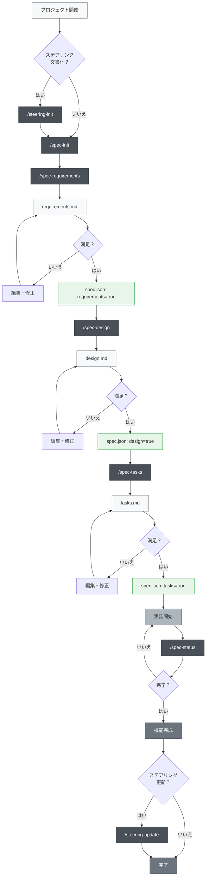
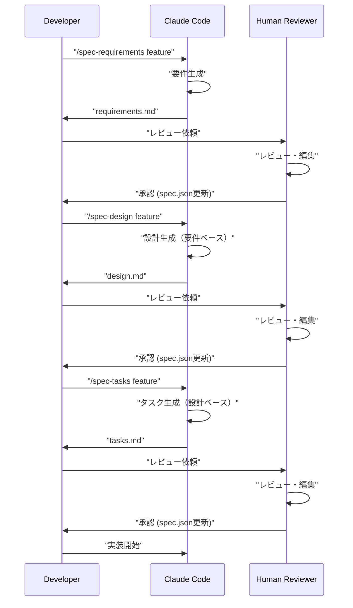

# Claude Code Spec-Driven Development

Claude Codeのスラッシュコマンドを使用して、Kiro-style Spec-Driven Developmentを実践するためのプロジェクト。

## 概要

このプロジェクトは、Claude Codeのスラッシュコマンド機能を活用して、仕様駆動開発（Spec-Driven Development）を効率的に行うためのツールセットを提供する。各開発フェーズで適切なコマンドを使用することで、体系的かつ品質の高い開発プロセスを実現できる。

## セットアップ

### 自分のプロジェクトに導入する

Claude Code Spec-Driven Developmentを自分のプロジェクトに導入するには、以下の2つのファイル/ディレクトリをコピーするだけ

1. **`.claude/commands/` ディレクトリ** - スラッシュコマンドの定義
2. **`CLAUDE.md` ファイル** - Claude Codeの設定とプロジェクト指示


### 初回セットアップ手順

1. **ファイルをコピー**（上記参照）
2. **CLAUDE.mdをコピー**してプロジェクトに合わせて調整
3. **最初のコマンドを実行**:
   ```bash
   # オプション: ステアリング文書を作成
   /steering-init
   
   # 最初の機能仕様を作成
   /spec-init "あなたのプロジェクトの詳細な説明"
   ```

### 必要なディレクトリ構造

コマンドを実行すると、以下のディレクトリが自動的に作成される

```
あなたのプロジェクト/
├── .claude/
│   └── commands/          # コピーしたコマンド定義
├── .kiro/
│   ├── steering/          # 自動生成されるステアリング文書
│   └── specs/             # 自動生成される機能仕様
├── CLAUDE.md              # コピーした設定ファイル
└── （あなたのプロジェクトファイル）
```

## 使い方

### 1. 新規プロジェクトの場合

```bash
# オプション: プロジェクトステアリング生成（推奨だが必須ではない）
/steering-init

# ステップ1: 新機能の仕様作成開始（詳細な説明を含める）
/spec-init "ユーザーがPDFをアップロードして、その中の図表を抽出し、AIが内容を説明する機能を作りたい。技術スタックはNext.js、TypeScript、Tailwind CSSを使用。"

# ステップ2: 要件定義（自動生成されたfeature-nameを使用）
/spec-requirements pdf-diagram-extractor
# → .kiro/specs/pdf-diagram-extractor/requirements.md をレビュー・編集

# ステップ3: 要件承認（手動）
# spec.json で "requirements": true に設定

# ステップ4: 技術設計
/spec-design pdf-diagram-extractor
# → .kiro/specs/pdf-diagram-extractor/design.md をレビュー・編集

# ステップ5: 設計承認（手動）
# spec.json で "design": true に設定

# ステップ6: タスク生成
/spec-tasks pdf-diagram-extractor
# → .kiro/specs/pdf-diagram-extractor/tasks.md をレビュー・編集

# ステップ7: タスク承認（手動）
# spec.json で "tasks": true に設定

# ステップ8: 実装開始
```

### 2. 既存プロジェクトへの機能追加

```bash
# オプション: ステアリング更新（プロジェクトに大きな変更があった場合）
/steering-update

# または、既存プロジェクトでも初めてステアリングを作成する場合
/steering-init

# ステップ1: 新機能の仕様作成開始
/spec-init "新しい機能の詳細な説明をここに記述"
# 以降は新規プロジェクトと同じ
```

### 3. 進捗確認

```bash
# 特定機能の進捗確認
/spec-status my-feature

# 現在のフェーズ、承認状況、タスク進捗が表示される
```

## Spec-Driven Development プロセス

### プロセスフロー図

このフローでは、各フェーズで「レビュー・承認」にspec.jsonの更新が含まれている。

**ステアリング文書**は、プロジェクトに関する永続的な知識（アーキテクチャ、技術スタック、コード規約など）を記録するドキュメントです。作成・更新はオプションだが、プロジェクトの長期的な保守性を高めるために推奨される。



## スラッシュコマンド一覧

### 🚀 Phase 0: プロジェクトステアリング（オプション）

| コマンド | 用途 | 使用タイミング |
|---------|------|---------------|
| `/steering-init` | 初期ステアリング文書の生成 | 新規/既存プロジェクトで文書化が必要な時 |
| `/steering-update` | ステアリング文書の更新 | 大きな変更後、定期的なメンテナンス時 |
| `/steering-custom` | カスタムステアリング文書の作成 | 特殊な規約やガイドラインが必要な時 |

**注意**: ステアリング文書は推奨されるが必須ではない。小規模な機能追加や試験的な開発では省略可能。

#### ステアリング文書の種類
- **product.md**: プロダクト概要、機能、ユースケース
- **tech.md**: アーキテクチャ、技術スタック、開発環境
- **structure.md**: ディレクトリ構造、コード規約、命名規則
- **カスタム文書**: API規約、テスト方針、セキュリティポリシー等

### 📋 Phase 1: 仕様作成

| コマンド | 用途 | 使用タイミング |
|---------|------|---------------|
| `/spec-init [詳細なプロジェクト説明]` | プロジェクト説明から仕様構造を初期化 | 新機能開発開始時 |
| `/spec-requirements [feature-name]` | 要件定義書の生成 | 仕様初期化後すぐ |
| `/spec-design [feature-name]` | 技術設計書の生成 | 要件承認後 |
| `/spec-tasks [feature-name]` | 実装タスクの生成 | 設計承認後 |

### 📊 Phase 2: 進捗管理

| コマンド | 用途 | 使用タイミング |
|---------|------|---------------|
| `/spec-status [feature-name]` | 現在の進捗とフェーズ確認 | 開発中随時 |

## 3フェーズ承認ワークフロー

このシステムの核心は、各フェーズで人間によるレビューと承認を必須とする



## ベストプラクティス

### ✅ 推奨事項

1. **常にステアリングから開始**
   - 新規プロジェクトでは必ず `/steering-init` を実行
   - 既存プロジェクトでも `/steering-update` で最新化

2. **フェーズを飛ばさない**
   - 要件 → 設計 → タスクの順序を厳守
   - 各フェーズで必ず人間によるレビューを実施

3. **定期的な進捗確認**
   - `/spec-status` で現在の状況を把握
   - タスクの完了状況を適切に更新

4. **ステアリングの保守**
   - 大きな変更後は `/steering-update` を実行
   - プロジェクトの成長に合わせて更新

### ❌ 避けるべきこと

1. **承認なしでの次フェーズ移行**
   - spec.jsonの手動更新を忘れない

2. **ステアリング文書の放置**
   - 古い情報は開発の妨げになる

3. **タスクステータスの未更新**
   - 進捗が不明確になり管理が困難に

## プロジェクト構造

```
.
├── .claude/
│   └── commands/          # スラッシュコマンド定義
│       ├── spec-init.md
│       ├── spec-requirements.md
│       ├── spec-design.md
│       ├── spec-tasks.md
│       ├── spec-status.md
│       ├── steering-init.md
│       ├── steering-update.md
│       └── steering-custom.md
├── .kiro/
│   ├── steering/          # ステアリング文書
│   │   ├── product.md
│   │   ├── tech.md
│   │   └── structure.md
│   └── specs/             # 機能仕様
│       └── [feature-name]/
│           ├── spec.json      # フェーズ承認状態
│           ├── requirements.md # 要件定義書
│           ├── design.md      # 技術設計書
│           └── tasks.md       # 実装タスク
├── CLAUDE.md              # Claude Code用設定
└── README.md              # このファイル
```

## 自動化機能

Claude Codeのフック機能により以下が自動化されている

- タスク進捗の自動追跡
- 仕様遵守のチェック
- コンパクト時のコンテキスト保持
- ステアリングドリフトの検出

## トラブルシューティング

### コマンドが動作しない場合
1. `.claude/commands/` ディレクトリの存在を確認
2. コマンドファイルの命名規則を確認（`command-name.md`）
3. Claude Codeの最新バージョンを使用しているか確認

### 承認フローで詰まった場合
1. `spec.json` の承認フラグを手動で確認
2. 前フェーズの承認が完了しているか確認
3. `/spec-status` で現在の状態を診断

## まとめ

Claude Codeのスラッシュコマンドを活用したSpec-Driven Developmentにより、以下が実現できる

- 📐 体系的な開発プロセス
- ✅ 品質保証のための段階的承認
- 📊 透明性の高い進捗管理
- 🔄 継続的なドキュメント更新
- 🤖 AIアシストによる効率化

このシステムを使用することで、開発の品質と効率を大幅に向上させることができる。