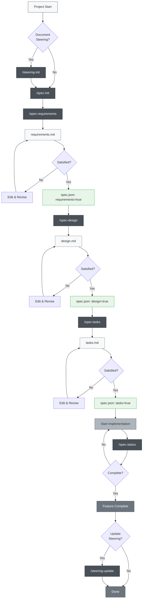
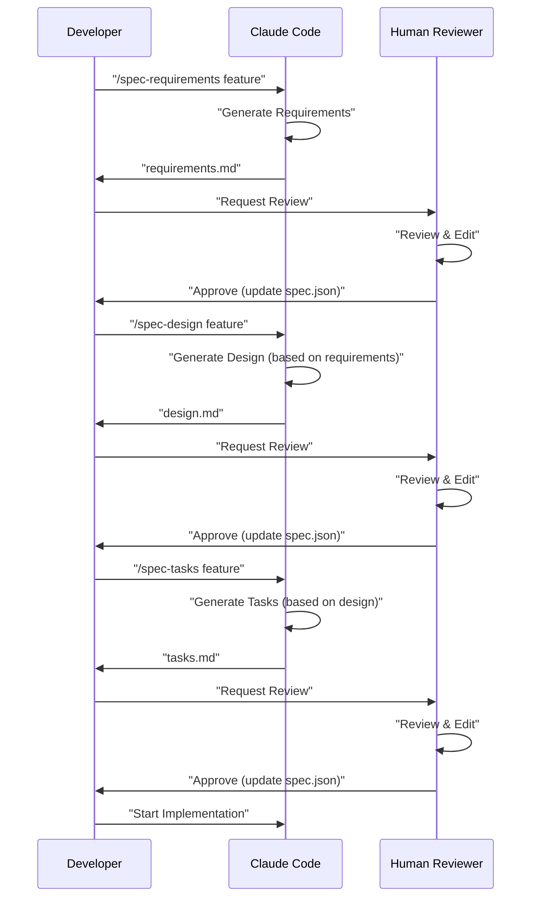

# Claude Code Spec-Driven Development

> [!Warning]
> This is an initial version and will be improved as we use it

A project to practice Spec-Driven Development using Claude Code's Slash Commands and CLAUDE.md, incorporating the same directory structure as Kiro IDE. This project closely replicates the actual specification-driven development workflow from Kiro, including directory structure.

## Overview

This project provides a toolset for efficient Spec-Driven Development using Claude Code's Slash Commands. By using appropriate commands for each development phase, you can achieve a systematic and high-quality development process.

## Setup

### Integrating into Your Own Project

To integrate Claude Code Spec-Driven Development into your project, simply copy these 2 files/directories:

1. **`.claude/commands/` directory** - Slash Commands definitions
2. **`CLAUDE_en.md` file** - English version of Claude Code configuration and project instructions


### Initial Setup Steps

1. **Copy files** (see above)
2. **Copy CLAUDE_en.md and rename it to CLAUDE.md**, then adjust it for your project
3. **Configure language** (if needed): If generated content appears in Japanese, change `"language": "japanese"` to `"language": "english"` in `.claude/commands/spec-init.md`
4. **Run initial commands**:
   ```bash
   # Optional: Create steering documents
   /steering-init
   
   # Create your first feature specification
   /spec-init "Detailed description of your project"
   ```

### Required Directory Structure

When you run commands, the following directories will be automatically created:

```
your-project/
├── .claude/
│   └── commands/          # Copied command definitions
├── .kiro/
│   ├── steering/          # Auto-generated steering documents
│   └── specs/             # Auto-generated feature specifications  
├── CLAUDE.md              # Copied and renamed from CLAUDE_en.md
└── (your project files)
```

## Usage

### 1. For New Projects

```bash
# Optional: Generate project steering (recommended but not required)
/steering-init

# Step 1: Start creating new feature specification (include detailed description)
/spec-init "I want to create a feature where users can upload PDFs, extract diagrams and charts from them, and have AI explain the content. Tech stack: Next.js, TypeScript, Tailwind CSS."

# Step 2: Requirements definition (use auto-generated feature-name)
/spec-requirements pdf-diagram-extractor
# → Review and edit .kiro/specs/pdf-diagram-extractor/requirements.md

# Step 3: Requirements approval (manual)
# Set "requirements": true in spec.json

# Step 4: Technical design
/spec-design pdf-diagram-extractor
# → Review and edit .kiro/specs/pdf-diagram-extractor/design.md

# Step 5: Design approval (manual)
# Set "design": true in spec.json

# Step 6: Task generation
/spec-tasks pdf-diagram-extractor
# → Review and edit .kiro/specs/pdf-diagram-extractor/tasks.md

# Step 7: Task approval (manual)
# Set "tasks": true in spec.json

# Step 8: Start implementation
```

### 2. Adding Features to Existing Projects

```bash
# Optional: Update steering (if there have been major changes to the project)
/steering-update

# Or, if creating steering for an existing project for the first time
/steering-init

# Step 1: Start creating new feature specification
/spec-init "Detailed description of the new feature here"
# Following steps are the same as for new projects
```

### 3. Progress Tracking

```bash
# Check progress of a specific feature
/spec-status my-feature

# Displays current phase, approval status, and task progress
```

## Spec-Driven Development Process

### Process Flow Diagram

In this flow, each phase includes updating spec.json as part of "Review & Approval".

**Steering documents** are documents that record persistent knowledge about the project (architecture, tech stack, code conventions, etc.). Creating and updating them is optional but recommended for long-term maintainability of the project.



## Slash Commands Reference

### 🚀 Phase 0: Project Steering (Optional)

| Command | Purpose | When to Use |
|---------|---------|-------------|
| `/steering-init` | Generate initial steering documents | When documentation is needed for new/existing projects |
| `/steering-update` | Update steering documents | After major changes, during regular maintenance |
| `/steering-custom` | Create custom steering documents | When special conventions or guidelines are needed |

**Note**: Steering documents are recommended but not required. They can be omitted for small feature additions or experimental development.

#### Types of Steering Documents
- **product.md**: Product overview, features, use cases
- **tech.md**: Architecture, tech stack, development environment
- **structure.md**: Directory structure, code conventions, naming rules
- **Custom documents**: API conventions, testing policies, security policies, etc.

### 📋 Phase 1: Specification Creation

| Command | Purpose | When to Use |
|---------|---------|-------------|
| `/spec-init [detailed project description]` | Initialize specification structure from project description | When starting new feature development |
| `/spec-requirements [feature-name]` | Generate requirements document | Immediately after spec initialization |
| `/spec-design [feature-name]` | Generate technical design document | After requirements approval |
| `/spec-tasks [feature-name]` | Generate implementation tasks | After design approval |

### 📊 Phase 2: Progress Management

| Command | Purpose | When to Use |
|---------|---------|-------------|
| `/spec-status [feature-name]` | Check current progress and phase | Regularly during development |

## 3-Phase Approval Workflow

The core of this system requires human review and approval at each phase:



## Best Practices

### ✅ Recommendations

1. **Always start with steering**
   - Always run `/steering-init` for new projects
   - Update existing projects with `/steering-update`

2. **Don't skip phases**
   - Strictly follow the order: Requirements → Design → Tasks
   - Ensure human review at each phase

3. **Regular progress checks**
   - Use `/spec-status` to understand current situation
   - Update task completion status appropriately

4. **Maintain steering**
   - Run `/steering-update` after major changes
   - Update as the project grows

### ❌ Things to Avoid

1. **Moving to next phase without approval**
   - Don't forget to manually update spec.json

2. **Neglecting steering documents**
   - Outdated information hinders development

3. **Not updating task status**
   - Progress becomes unclear and management becomes difficult

## Project Structure

```
.
├── .claude/
│   └── commands/          # Slash command definitions
│       ├── spec-init.md
│       ├── spec-requirements.md
│       ├── spec-design.md
│       ├── spec-tasks.md
│       ├── spec-status.md
│       ├── steering-init.md
│       ├── steering-update.md
│       └── steering-custom.md
├── .kiro/
│   ├── steering/          # Steering documents
│   │   ├── product.md
│   │   ├── tech.md
│   │   └── structure.md
│   └── specs/             # Feature specifications
│       └── [feature-name]/
│           ├── spec.json      # Phase approval status
│           ├── requirements.md # Requirements document
│           ├── design.md      # Technical design document
│           └── tasks.md       # Implementation tasks
├── CLAUDE.md              # Claude Code configuration
├── CLAUDE_en.md           # English version of Claude Code configuration
├── README.md              # This file (Japanese)
└── README_en.md           # English version README
```

## Automation Features

The following are automated through Claude Code's hook functionality:

- Automatic task progress tracking
- Specification compliance checking
- Context preservation during compaction
- Steering drift detection

## Troubleshooting

### When commands don't work
1. Check existence of `.claude/commands/` directory
2. Verify command file naming convention (`command-name.md`)
3. Ensure you're using the latest version of Claude Code

### When stuck in approval flow
1. Manually check approval flags in `spec.json`
2. Verify previous phase approval is complete
3. Use `/spec-status` to diagnose current state

## Summary

Claude Code's Slash Commands enable Spec-Driven Development that achieves:

- 📐 Systematic development process
- ✅ Quality assurance through phased approval
- 📊 Transparent progress management
- 🔄 Continuous documentation updates
- 🤖 AI-assisted efficiency

Using this system can significantly improve development quality and efficiency.