# Claude Code 規格驅動開發

> 🌐 **語言**  
> 📖 **[英文版](README_en.md)** | 📖 **[日本語版 README](README.md)** | 📖 **繁體中文說明**（本頁）

> [!警告]
> 這是初始版本，將隨著使用逐步改進

本專案旨在透過 Claude Code 的 Slash Commands 及 CLAUDE.md，實踐規格驅動開發（Spec-Driven Development），並採用與 Kiro IDE 相同的目錄結構。此專案高度還原 Kiro 的實際規格驅動開發流程與目錄設計。

## 專案簡介

本專案提供一套高效規格驅動開發的工具組，利用 Claude Code 的 Slash Commands，讓每個開發階段都能系統化、高品質地推進。

## 安裝與設定

### 整合到你的專案

要將 Claude Code 規格驅動開發整合進你的專案，只需複製以下兩個檔案/目錄：

1. **`.claude/commands/` 目錄** - Slash Commands 定義
2. **`CLAUDE_zh-TW.md` 檔案** - 中文版 Claude Code 設定與專案說明

### 初始設定步驟

1. **複製檔案**（如上）
2. **將 CLAUDE_zh-TW.md 複製並重新命名為 CLAUDE.md**，再根據你的專案調整內容
3. **語言設定**（如有需要）：若產生內容為日文，請將 `.claude/commands/kiro/spec-init.md` 中的 `"language": "japanese"` 改為 `"language": "traditional chinese"`
4. **執行初始指令**：
   ```bash
   # 選用：建立 steering 文件
   /kiro:steering-init
   
   # 建立第一個功能規格
   /kiro:spec-init "請詳細描述你的專案"
   ```

### 必要目錄結構

執行指令後，會自動建立以下目錄：

```
your-project/
├── .claude/
│   └── commands/          # 指令定義
├── .kiro/
│   ├── steering/          # 自動產生的 steering 文件
│   └── specs/             # 自動產生的功能規格
├── CLAUDE.md              # 由 CLAUDE_zh-TW.md 複製並改名（專案主要設定）
├── CLAUDE_zh-TW.md        # 繁體中文版 Claude Code 設定
├── CLAUDE_en.md           # 英文版 Claude Code 設定
├── README.md              # 日文版 README
├── README_en.md           # 英文版 README
├── README_zh-TW.md        # 繁體中文版 README
└── (你的專案檔案)
```

## 使用方式

### 1. 新專案

```bash
# 選用：產生 steering 文件（建議但非必須）
/kiro:steering-init

# 步驟1：建立新功能規格（請詳細描述需求）
/kiro:spec-init "我想建立一個讓使用者上傳 PDF，從中擷取圖表並由 AI 解釋內容的功能。技術棧：Next.js、TypeScript、Tailwind CSS。"

# 步驟2：需求定義（使用自動產生的功能名稱）
/kiro:spec-requirements pdf-diagram-extractor
# → 編輯 .kiro/specs/pdf-diagram-extractor/requirements.md

# 步驟3：需求審核（人工）
# 在 spec.json 設定 "requirements": true

# 步驟4：技術設計
/kiro:spec-design pdf-diagram-extractor
# → 編輯 .kiro/specs/pdf-diagram-extractor/design.md

# 步驟5：設計審核（人工）
# 在 spec.json 設定 "design": true

# 步驟6：產生實作任務
/kiro:spec-tasks pdf-diagram-extractor
# → 編輯 .kiro/specs/pdf-diagram-extractor/tasks.md

# 步驟7：任務審核（人工）
# 在 spec.json 設定 "tasks": true

# 步驟8：開始實作
```

### 2. 為現有專案新增功能

```bash
# 選用：更新 steering（若專案有重大變更）
/kiro:steering-update

# 或，首次為現有專案建立 steering
/kiro:steering-init

# 步驟1：建立新功能規格
/kiro:spec-init "請詳細描述新功能"
# 後續步驟同新專案
```

### 3. 進度追蹤

```bash
# 查詢特定功能進度
/kiro:spec-status my-feature

# 顯示目前階段、審核狀態與任務進度
```

## 規格驅動開發流程

### 流程圖

在此流程中，每個階段的「審查與核准」都包含更新 spec.json。

**Steering 文件**：記錄專案持久知識（架構、技術棧、程式規範等），建立與維護 steering 文件雖非強制，但對長期維護極有幫助。

```mermaid
graph TD
    A["專案開始"] --> B{"建立<br/>Steering？"}
    B -->|是| C["/kiro:steering-init"]
    B -->|否| D["/kiro:spec-init"]
    C --> D
    
    D --> E["/kiro:spec-requirements"]
    E --> F["requirements.md"]
    F --> G{"滿意？"}
    G -->|否| G1["編輯修正"]
    G1 --> F
    G -->|是| H["spec.json: requirements=true"]
    
    H --> I["/kiro:spec-design"]
    I --> J["design.md"]
    J --> K{"滿意？"}
    K -->|否| K1["編輯修正"]
    K1 --> J
    K -->|是| L["spec.json: design=true"]
    
    L --> M["/kiro:spec-tasks"]
    M --> N["tasks.md"]
    N --> O{"滿意？"}
    O -->|否| O1["編輯修正"]
    O1 --> N
    O -->|是| P["spec.json: tasks=true"]
    
    P --> Q["開始實作"]
    Q --> R["/kiro:spec-status"]
    R --> S{"完成？"}
    S -->|否| Q
    S -->|是| T["功能完成"]
    
    T --> U{"更新<br/>Steering？"}
    U -->|是| V["/kiro:steering-update"]
    U -->|否| W["結束"]
    V --> W
    
    %% 樣式定義
    style A fill:#f8f9fa,stroke:#495057
    style C fill:#495057,stroke:#343a40,color:#ffffff
    style D fill:#495057,stroke:#343a40,color:#ffffff
    style E fill:#495057,stroke:#343a40,color:#ffffff
    style I fill:#495057,stroke:#343a40,color:#ffffff
    style M fill:#495057,stroke:#343a40,color:#ffffff
    style R fill:#495057,stroke:#343a40,color:#ffffff
    style V fill:#495057,stroke:#343a40,color:#ffffff
    style F fill:#f8f9fa,stroke:#6c757d
    style J fill:#f8f9fa,stroke:#6c757d
    style N fill:#f8f9fa,stroke:#6c757d
    style H fill:#e8f5e9,stroke:#28a745
    style L fill:#e8f5e9,stroke:#28a745
    style P fill:#e8f5e9,stroke:#28a745
    style Q fill:#adb5bd,stroke:#495057
    style T fill:#6c757d,stroke:#495057,color:#ffffff
    style W fill:#6c757d,stroke:#495057,color:#ffffff
```



## Slash Commands 指令參考

### 🚀 階段0：專案 Steering（選用）

| 指令 | 目的 | 使用時機 |
|------|------|----------|
| `/kiro:steering-init` | 產生初始 steering 文件 | 新專案或現有專案需建立文件時 |
| `/kiro:steering-update` | 更新 steering 文件 | 專案有重大變更或定期維護時 |
| `/kiro:steering-custom` | 建立自訂 steering 文件 | 需特殊規範或指引時 |

**備註**：Steering 文件建議建立，但非強制。小型功能或實驗性開發可省略。

#### Steering 文件類型
- **product.md**：產品概述、功能、使用情境
- **tech.md**：架構、技術棧、開發環境
- **structure.md**：目錄結構、程式規範、命名規則
- **自訂文件**：API 規範、測試政策、安全政策等

### 📋 階段1：規格建立

| 指令 | 目的 | 使用時機 |
|------|------|----------|
| `/kiro:spec-init [詳細專案描述]` | 根據描述初始化規格結構 | 新功能開發啟動時 |
| `/kiro:spec-requirements [功能名稱]` | 產生需求文件 | 規格初始化後立即執行 |
| `/kiro:spec-design [功能名稱]` | 產生技術設計文件 | 需求審核通過後 |
| `/kiro:spec-tasks [功能名稱]` | 產生實作任務 | 設計審核通過後 |

### 📊 階段2：進度管理

| 指令 | 目的 | 使用時機 |
|------|------|----------|
| `/kiro:spec-status [功能名稱]` | 查詢目前進度與階段 | 開發過程中定期查詢 |

## 三階段審核流程

本系統核心為每個階段都需人工審核與核准：

```mermaid
sequenceDiagram
    participant D as 開發者
    participant C as Claude Code
    participant H as 人工審核者
    
    D->>C: "/kiro:spec-requirements feature"
    C->>C: "產生需求文件"
    C->>D: "requirements.md"
    D->>H: "請求審核"
    H->>H: "審查與編輯"
    H->>D: "核准（更新 spec.json）"
    
    D->>C: "/kiro:spec-design feature"
    C->>C: "根據需求產生設計"
    C->>D: "design.md"
    D->>H: "請求審核"
    H->>H: "審查與編輯"
    H->>D: "核准（更新 spec.json）"
    
    D->>C: "/kiro:spec-tasks feature"
    C->>C: "根據設計產生任務"
    C->>D: "tasks.md"
    D->>H: "請求審核"
    H->>H: "審查與編輯"
    H->>D: "核准（更新 spec.json）"
    
    D->>C: "開始實作"
```



## 最佳實踐

### ✅ 建議事項

1. **務必從 steering 開始**
   - 新專案請先執行 `/kiro:steering-init`
   - 既有專案請用 `/kiro:steering-update` 維護

2. **不可跳過階段**
   - 嚴格遵循：需求 → 設計 → 任務
   - 每階段都需人工審核

3. **定期檢查進度**
   - 用 `/kiro:spec-status` 掌握現況
   - 任務完成狀態要及時更新

4. **維護 steering 文件**
   - 重大變更後執行 `/kiro:steering-update`
   - 隨專案成長持續更新

### ❌ 避免事項

1. **未核准就進入下一階段**
   - 務必手動更新 spec.json

2. **忽略 steering 文件**
   - 過時資訊會阻礙開發

3. **未更新任務狀態**
   - 進度不明，管理困難

## 專案結構

```
.
├── .claude/
│   └── commands/          # Slash 指令定義
│       └── kiro/
│           ├── spec-init.md
│           ├── spec-requirements.md
│           ├── spec-design.md
│           ├── spec-tasks.md
│           ├── spec-status.md
│           ├── steering-init.md
│           ├── steering-update.md
│           └── steering-custom.md
├── .kiro/
│   ├── steering/          # Steering 文件
│   │   ├── product.md
│   │   ├── tech.md
│   │   └── structure.md
│   └── specs/             # 功能規格
│       └── [feature-name]/
│           ├── spec.json      # 階段核准狀態
│           ├── requirements.md # 需求文件
│           ├── design.md      # 技術設計文件
│           └── tasks.md       # 實作任務
├── CLAUDE.md              # 主要設定（可依專案語言複製自下方任一語言檔案）
├── CLAUDE_zh-TW.md        # 繁體中文版 Claude Code 設定
├── CLAUDE_en.md           # 英文版 Claude Code 設定
├── README.md              # 日文版 README
├── README_en.md           # 英文版 README
├── README_zh-TW.md        # 繁體中文版 README
└── (你的專案檔案)
```

## 自動化功能

以下功能由 Claude Code 的 hook 自動實現：

- 任務進度自動追蹤
- 規格符合性檢查
- 壓縮時保留上下文
- Steering 漂移偵測

## 疑難排解

### 指令無法運作時
1. 檢查 `.claude/commands/` 目錄是否存在
2. 確認指令檔案命名規則（`command-name.md`）
3. 確保使用最新版 Claude Code

### 卡在審核流程時
1. 手動檢查 spec.json 的核准標記
2. 確認前一階段已核准
3. 用 `/kiro:spec-status` 診斷目前狀態

## 摘要

Claude Code 的 Slash Commands 讓規格驅動開發具備：

- 📐 系統化開發流程
- ✅ 分階段審核確保品質
- 📊 透明進度管理
- 🔄 文件持續更新
- 🤖 AI 助力提升效率

善用此系統，能大幅提升開發品質與效率。 