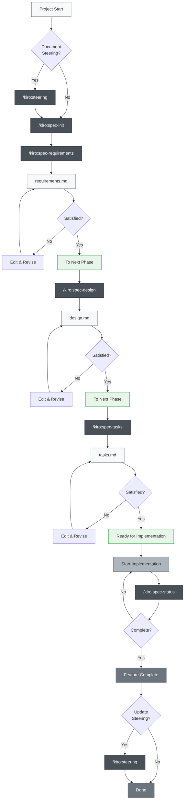
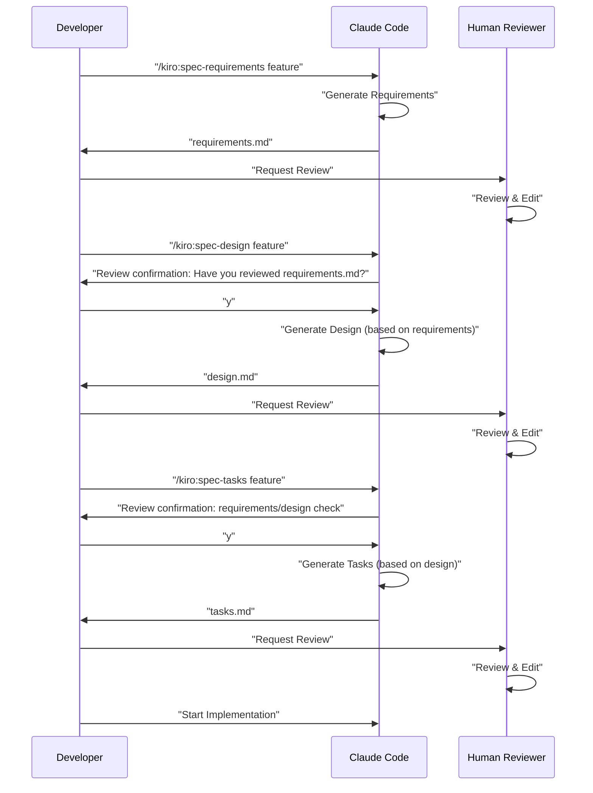

# Claude Code Spec-Driven Development

> 🌐 **Language**  
> 📖 **English Version** (This page) | 📖 **[日本語版 README](README.md)** | 📖 **[繁體中文說明](README_zh-TW.md)**

> [!Warning]
> This is an initial version and will be improved as we use it

A project to practice Spec-Driven Development using Claude Code's Slash Commands and CLAUDE.md, incorporating the same directory structure as Kiro IDE. This project closely replicates the actual specification-driven development workflow from Kiro, including directory structure.

## Overview

This project provides a toolset for efficient Spec-Driven Development using Claude Code's Slash Commands. By using appropriate commands for each development phase, you can achieve a systematic and high-quality development process.

## Setup

### Integrating into Your Own Project

To integrate Claude Code Spec-Driven Development into your project, simply copy these 2 files/directories:

1. **`.claude/commands/` directory** - Slash Commands definitions
2. **`CLAUDE_en.md` file** - English version of Claude Code configuration and project instructions


### Initial Setup Steps

1. **Copy files** (see above)
2. **Copy CLAUDE_en.md and rename it to CLAUDE.md**, then adjust it for your project
3. **Configure language** (if needed): If generated content appears in Japanese, change `"language": "japanese"` to `"language": "english"` in `.claude/commands/kiro/spec-init.md`
4. **Run initial commands**:
   ```bash
   # Optional: Create steering documents
   /kiro:steering
   
   # Create your first feature specification
   /kiro:spec-init "Detailed description of your project"
   ```

### Required Directory Structure

When you run commands, the following directories will be automatically created:

```
your-project/
├── .claude/
│   └── commands/          # Copied command definitions
├── .kiro/
│   ├── steering/          # Auto-generated steering documents
│   └── specs/             # Auto-generated feature specifications  
├── CLAUDE.md              # Copied and renamed from a language-specific file (e.g., CLAUDE_en.md or CLAUDE_zh-TW.md)
├── CLAUDE_en.md           # English version of Claude Code configuration
├── CLAUDE_zh-TW.md        # Traditional Chinese version of Claude Code configuration
├── README.md              # Japanese version README
├── README_en.md           # English version README
├── README_zh-TW.md        # Traditional Chinese version README
└── (your project files)
```

## Usage

### 1. For New Projects

```bash
# Optional: Generate project steering (recommended but not required)
/kiro:steering

# Step 1: Start creating new feature specification (include detailed description)
/kiro:spec-init "I want to create a feature where users can upload PDFs, extract diagrams and charts from them, and have AI explain the content. Tech stack: Next.js, TypeScript, Tailwind CSS."

# Step 2: Requirements definition (use auto-generated feature-name)
/kiro:spec-requirements pdf-diagram-extractor
# → Review and edit .kiro/specs/pdf-diagram-extractor/requirements.md

# Step 3: Technical design (interactive approval)
/kiro:spec-design pdf-diagram-extractor
# → Respond to "Have you reviewed requirements.md? [y/N]"
# → Review and edit .kiro/specs/pdf-diagram-extractor/design.md

# Step 4: Task generation (interactive approval)
/kiro:spec-tasks pdf-diagram-extractor
# → Respond to review confirmation for requirements and design
# → Review and edit .kiro/specs/pdf-diagram-extractor/tasks.md

# Step 5: Start implementation
```

### 2. Adding Features to Existing Projects

```bash
# Optional: Create or update steering
# Same command handles both new creation and updates
/kiro:steering

# Step 1: Start creating new feature specification
/kiro:spec-init "Detailed description of the new feature here"
# Following steps are the same as for new projects
```

### 3. Progress Tracking

```bash
# Check progress of a specific feature
/kiro:spec-status my-feature

# Displays current phase, approval status, and task progress
```

## Spec-Driven Development Process

### Process Flow Diagram

In this flow, each phase requires "Review & Approval".

**Steering documents** are documents that record persistent knowledge about the project (architecture, tech stack, code conventions, etc.). Creating and updating them is optional but recommended for long-term maintainability of the project.



## Slash Commands Reference

### 🚀 Phase 0: Project Steering (Optional)

| Command | Purpose | When to Use |
|---------|---------|-------------|
| `/kiro:steering` | Smart creation or update of steering documents | All scenarios (both new and updates) |
| `/kiro:steering-custom` | Create custom steering documents | When special conventions or guidelines are needed |

**Note**: Steering documents are recommended but not required. They can be omitted for small feature additions or experimental development.

#### Types of Steering Documents
- **product.md**: Product overview, features, use cases
- **tech.md**: Architecture, tech stack, development environment
- **structure.md**: Directory structure, code conventions, naming rules
- **Custom documents**: API conventions, testing policies, security policies, etc.

### 📋 Phase 1: Specification Creation

| Command | Purpose | When to Use |
|---------|---------|-------------|
| `/kiro:spec-init [detailed project description]` | Initialize specification structure from project description | When starting new feature development |
| `/kiro:spec-requirements [feature-name]` | Generate requirements document | Immediately after spec initialization |
| `/kiro:spec-design [feature-name]` | Generate technical design document | After requirements approval |
| `/kiro:spec-tasks [feature-name]` | Generate implementation tasks | After design approval |

### 📊 Phase 2: Progress Management

| Command | Purpose | When to Use |
|---------|---------|-------------|
| `/kiro:spec-status [feature-name]` | Check current progress and phase | Regularly during development |

## 3-Phase Approval Workflow

The core of this system requires human review and approval at each phase:



## Best Practices

### ✅ Recommendations

1. **Always start with steering**
   - Use `/kiro:steering` for all scenarios (intelligently handles both creation and updates)
   - The unified command protects existing files while handling them appropriately

2. **Don't skip phases**
   - Strictly follow the order: Requirements → Design → Tasks
   - Ensure human review at each phase

3. **Regular progress checks**
   - Use `/kiro:spec-status` to understand current situation
   - Update task completion status appropriately

4. **Maintain steering**
   - Run `/kiro:steering` after major changes (automatically determines update strategy)
   - Update as the project grows

### ❌ Things to Avoid

1. **Moving to next phase without approval**
   - Don't forget to respond to confirmation prompts

2. **Neglecting steering documents**
   - Outdated information hinders development

3. **Not updating task status**
   - Progress becomes unclear and management becomes difficult

## Project Structure

```
.
├── .claude/
│   └── commands/          # Slash command definitions
│       └── kiro/
│           ├── spec-init.md
│           ├── spec-requirements.md
│           ├── spec-design.md
│           ├── spec-tasks.md
│           ├── spec-status.md
│           ├── steering.md          # Unified steering command
│           └── steering-custom.md
├── .kiro/
│   ├── steering/          # Steering documents
│   │   ├── product.md
│   │   ├── tech.md
│   │   └── structure.md
│   └── specs/             # Feature specifications
│       └── [feature-name]/
│           ├── spec.json      # Phase approval status
│           ├── requirements.md # Requirements document
│           ├── design.md      # Technical design document
│           └── tasks.md       # Implementation tasks
├── CLAUDE.md              # Main config (copied from a language-specific file below)
├── CLAUDE_en.md           # English version config
├── CLAUDE_zh-TW.md        # Traditional Chinese version config
├── README.md              # Japanese version README
├── README_en.md           # English version README
├── README_zh-TW.md        # Traditional Chinese version README
└── (your project files)
```

## Automation Features

The following are automated through Claude Code's hook functionality:

- Automatic task progress tracking
- Specification compliance checking
- Context preservation during compaction
- Steering drift detection

## Troubleshooting

### When commands don't work
1. Check existence of `.claude/commands/` directory
2. Verify command file naming convention (`command-name.md`)
3. Ensure you're using the latest version of Claude Code

### When stuck in approval flow
1. Check that you're responding correctly to review confirmation prompts
2. Verify previous phase approval is complete
3. Use `/kiro:spec-status` to diagnose current state
4. Manually check/edit `spec.json` if needed

## Summary

Claude Code's Slash Commands enable Spec-Driven Development that achieves:

- 📐 Systematic development process
- ✅ Quality assurance through phased approval
- 📊 Transparent progress management
- 🔄 Continuous documentation updates
- 🤖 AI-assisted efficiency

Using this system can significantly improve development quality and efficiency.