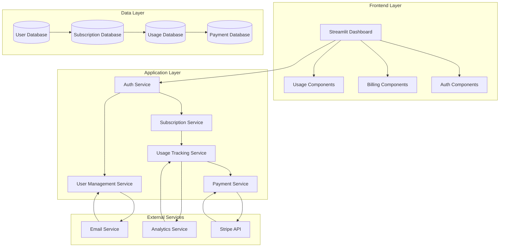

# Design Document

## Overview

The subscription billing system will transform the VOC Analysis Agent from a free application into a monetized SaaS product with three distinct pricing tiers. The system will integrate authentication, subscription management, usage tracking, and payment processing while maintaining the existing Streamlit-based user experience.

## Architecture

### High-Level Architecture



### System Integration Points

The billing system will integrate with existing components:

1. **Streamlit Frontend**: Add authentication wrapper and billing UI components
2. **LangGraph Workflow**: Add usage tracking middleware to monitor API calls and processing
3. **Database Layer**: New SQLite/PostgreSQL database for user and billing data
4. **External APIs**: Stripe for payments, SendGrid/AWS SES for emails

## Components and Interfaces

### 1. Authentication System

#### User Model
```python
class User(BaseModel):
    id: str = Field(description="Unique user identifier")
    email: str = Field(description="User email address")
    password_hash: str = Field(description="Hashed password")
    created_at: datetime = Field(description="Account creation timestamp")
    email_verified: bool = Field(default=False, description="Email verification status")
    is_active: bool = Field(default=True, description="Account active status")
    last_login: Optional[datetime] = Field(description="Last login timestamp")
```

#### Authentication Service
```python
class AuthService:
    async def register_user(self, email: str, password: str) -> AuthResult
    async def login_user(self, email: str, password: str) -> AuthResult
    async def verify_email(self, token: str) -> bool
    async def reset_password(self, email: str) -> bool
    async def change_password(self, user_id: str, old_password: str, new_password: str) -> bool
    async def get_current_user(self, session_token: str) -> Optional[User]
```

### 2. Subscription Management

#### Subscription Plans
```python
class SubscriptionPlan(BaseModel):
    id: str = Field(description="Plan identifier")
    name: str = Field(description="Plan display name")
    price_monthly: Decimal = Field(description="Monthly price in USD")
    features: Dict[str, Any] = Field(description="Plan features and limits")
    stripe_price_id: str = Field(description="Stripe price ID")
    is_active: bool = Field(default=True, description="Plan availability")

# Predefined plans
SUBSCRIPTION_PLANS = {
    "starter": SubscriptionPlan(
        id="starter",
        name="スターター",
        price_monthly=Decimal("29.00"),
        features={
            "max_monthly_analyses": 10,
            "max_rows_per_analysis": 1000,
            "export_formats": ["csv"],
            "email_support": True,
            "api_access": False
        },
        stripe_price_id="price_starter_monthly"
    ),
    "professional": SubscriptionPlan(
        id="professional", 
        name="プロフェッショナル",
        price_monthly=Decimal("79.00"),
        features={
            "max_monthly_analyses": 50,
            "max_rows_per_analysis": 10000,
            "export_formats": ["csv", "excel", "json"],
            "email_support": True,
            "priority_support": True,
            "api_access": True,
            "custom_labels": True
        },
        stripe_price_id="price_professional_monthly"
    ),
    "enterprise": SubscriptionPlan(
        id="enterprise",
        name="エンタープライズ", 
        price_monthly=Decimal("199.00"),
        features={
            "max_monthly_analyses": -1,  # Unlimited
            "max_rows_per_analysis": -1,  # Unlimited
            "export_formats": ["csv", "excel", "json", "pdf"],
            "email_support": True,
            "priority_support": True,
            "phone_support": True,
            "api_access": True,
            "custom_labels": True,
            "white_label": True,
            "dedicated_support": True
        },
        stripe_price_id="price_enterprise_monthly"
    )
}
```

#### Subscription Model
```python
class Subscription(BaseModel):
    id: str = Field(description="Subscription identifier")
    user_id: str = Field(description="Associated user ID")
    plan_id: str = Field(description="Current plan ID")
    status: SubscriptionStatus = Field(description="Subscription status")
    current_period_start: datetime = Field(description="Current billing period start")
    current_period_end: datetime = Field(description="Current billing period end")
    stripe_subscription_id: str = Field(description="Stripe subscription ID")
    created_at: datetime = Field(description="Subscription creation timestamp")
    updated_at: datetime = Field(description="Last update timestamp")

class SubscriptionStatus(str, Enum):
    ACTIVE = "active"
    PAST_DUE = "past_due"
    CANCELED = "canceled"
    UNPAID = "unpaid"
    TRIALING = "trialing"
```

#### Subscription Service
```python
class SubscriptionService:
    async def create_subscription(self, user_id: str, plan_id: str, payment_method_id: str) -> Subscription
    async def get_user_subscription(self, user_id: str) -> Optional[Subscription]
    async def upgrade_subscription(self, user_id: str, new_plan_id: str) -> Subscription
    async def cancel_subscription(self, user_id: str) -> bool
    async def reactivate_subscription(self, user_id: str) -> Subscription
    async def handle_webhook(self, webhook_data: Dict) -> bool
```

### 3. Usage Tracking System

#### Usage Model
```python
class UsageRecord(BaseModel):
    id: str = Field(description="Usage record identifier")
    user_id: str = Field(description="User identifier")
    analysis_id: str = Field(description="Analysis session identifier")
    rows_processed: int = Field(description="Number of rows processed")
    api_calls_made: int = Field(description="Number of API calls made")
    processing_time_seconds: float = Field(description="Processing time in seconds")
    created_at: datetime = Field(description="Usage timestamp")
    billing_period: str = Field(description="Billing period (YYYY-MM)")

class UsageSummary(BaseModel):
    user_id: str = Field(description="User identifier")
    billing_period: str = Field(description="Billing period")
    total_analyses: int = Field(description="Total analyses performed")
    total_rows_processed: int = Field(description="Total rows processed")
    total_api_calls: int = Field(description="Total API calls made")
    plan_limits: Dict[str, Any] = Field(description="Current plan limits")
    usage_percentage: Dict[str, float] = Field(description="Usage as percentage of limits")
```

#### Usage Tracking Service
```python
class UsageTrackingService:
    async def record_usage(self, user_id: str, analysis_data: Dict) -> UsageRecord
    async def get_current_usage(self, user_id: str) -> UsageSummary
    async def check_usage_limits(self, user_id: str, requested_rows: int) -> UsageCheckResult
    async def reset_monthly_usage(self, user_id: str) -> bool
    async def get_usage_history(self, user_id: str, months: int = 12) -> List[UsageSummary]
```

### 4. Payment Processing

#### Payment Service
```python
class PaymentService:
    async def create_payment_intent(self, user_id: str, plan_id: str) -> PaymentIntent
    async def confirm_payment(self, payment_intent_id: str) -> PaymentResult
    async def create_setup_intent(self, user_id: str) -> SetupIntent
    async def update_payment_method(self, user_id: str, payment_method_id: str) -> bool
    async def get_payment_history(self, user_id: str) -> List[PaymentRecord]
    async def handle_failed_payment(self, subscription_id: str) -> bool
```

### 5. Streamlit Integration Components

#### Authentication Wrapper
```python
class AuthWrapper:
    def __init__(self, auth_service: AuthService):
        self.auth_service = auth_service
    
    def require_auth(self, func):
        """Decorator to require authentication for Streamlit pages"""
        def wrapper(*args, **kwargs):
            if not self._is_authenticated():
                self._render_login_page()
                return
            return func(*args, **kwargs)
        return wrapper
    
    def _render_login_page(self):
        """Render login/registration form"""
        pass
```

#### Billing Dashboard Component
```python
class BillingDashboard:
    def render_subscription_status(self, user: User) -> None
    def render_usage_metrics(self, user: User) -> None
    def render_payment_history(self, user: User) -> None
    def render_plan_upgrade_options(self, user: User) -> None
```

## Data Models

### Database Schema

#### Users Table
```sql
CREATE TABLE users (
    id VARCHAR(36) PRIMARY KEY,
    email VARCHAR(255) UNIQUE NOT NULL,
    password_hash VARCHAR(255) NOT NULL,
    created_at TIMESTAMP DEFAULT CURRENT_TIMESTAMP,
    email_verified BOOLEAN DEFAULT FALSE,
    is_active BOOLEAN DEFAULT TRUE,
    last_login TIMESTAMP
);
```

#### Subscriptions Table
```sql
CREATE TABLE subscriptions (
    id VARCHAR(36) PRIMARY KEY,
    user_id VARCHAR(36) NOT NULL,
    plan_id VARCHAR(50) NOT NULL,
    status VARCHAR(20) NOT NULL,
    current_period_start TIMESTAMP NOT NULL,
    current_period_end TIMESTAMP NOT NULL,
    stripe_subscription_id VARCHAR(255) UNIQUE,
    created_at TIMESTAMP DEFAULT CURRENT_TIMESTAMP,
    updated_at TIMESTAMP DEFAULT CURRENT_TIMESTAMP,
    FOREIGN KEY (user_id) REFERENCES users(id)
);
```

#### Usage Records Table
```sql
CREATE TABLE usage_records (
    id VARCHAR(36) PRIMARY KEY,
    user_id VARCHAR(36) NOT NULL,
    analysis_id VARCHAR(36) NOT NULL,
    rows_processed INTEGER NOT NULL,
    api_calls_made INTEGER NOT NULL,
    processing_time_seconds FLOAT NOT NULL,
    created_at TIMESTAMP DEFAULT CURRENT_TIMESTAMP,
    billing_period VARCHAR(7) NOT NULL,
    FOREIGN KEY (user_id) REFERENCES users(id)
);
```

#### Payment Records Table
```sql
CREATE TABLE payment_records (
    id VARCHAR(36) PRIMARY KEY,
    user_id VARCHAR(36) NOT NULL,
    subscription_id VARCHAR(36) NOT NULL,
    stripe_payment_intent_id VARCHAR(255),
    amount DECIMAL(10,2) NOT NULL,
    currency VARCHAR(3) DEFAULT 'USD',
    status VARCHAR(20) NOT NULL,
    created_at TIMESTAMP DEFAULT CURRENT_TIMESTAMP,
    FOREIGN KEY (user_id) REFERENCES users(id),
    FOREIGN KEY (subscription_id) REFERENCES subscriptions(id)
);
```

## Error Handling

### Error Types
```python
class BillingError(Exception):
    """Base billing system error"""
    pass

class AuthenticationError(BillingError):
    """Authentication related errors"""
    pass

class SubscriptionError(BillingError):
    """Subscription management errors"""
    pass

class UsageLimitError(BillingError):
    """Usage limit exceeded errors"""
    pass

class PaymentError(BillingError):
    """Payment processing errors"""
    pass
```

### Error Handling Strategy
1. **Graceful Degradation**: Show appropriate error messages without breaking the UI
2. **Retry Logic**: Implement exponential backoff for transient failures
3. **Fallback Options**: Provide alternative actions when primary operations fail
4. **User Communication**: Clear, actionable error messages in Japanese
5. **Logging**: Comprehensive error logging for debugging and monitoring

## Testing Strategy

### Unit Tests
- Authentication service methods
- Subscription management logic
- Usage tracking calculations
- Payment processing workflows
- Database operations

### Integration Tests
- Stripe webhook handling
- Email notification delivery
- End-to-end subscription flow
- Usage limit enforcement
- Payment failure recovery

### UI Tests
- Authentication forms
- Subscription management interface
- Usage dashboard display
- Payment method updates
- Error state handling

### Load Tests
- Concurrent user authentication
- High-volume usage tracking
- Payment processing under load
- Database performance with large datasets

## Security Considerations

### Authentication Security
- Password hashing using bcrypt with salt
- JWT tokens with short expiration times
- Session management with secure cookies
- Rate limiting on authentication endpoints
- Email verification for new accounts

### Payment Security
- PCI compliance through Stripe integration
- No storage of payment card data
- Secure webhook signature verification
- HTTPS enforcement for all payment flows
- Audit logging for all payment operations

### Data Protection
- Encryption at rest for sensitive data
- Secure API key management
- User data anonymization options
- GDPR compliance for EU users
- Regular security audits and updates

## Performance Optimization

### Database Optimization
- Indexed queries for user lookups
- Partitioned usage tables by billing period
- Connection pooling for concurrent access
- Read replicas for analytics queries
- Automated backup and recovery

### Caching Strategy
- Redis cache for user sessions
- Subscription status caching
- Usage summary caching
- Payment method caching
- Cache invalidation on updates

### Monitoring and Analytics
- Real-time usage metrics
- Subscription churn analysis
- Payment success rates
- Performance monitoring
- Error rate tracking